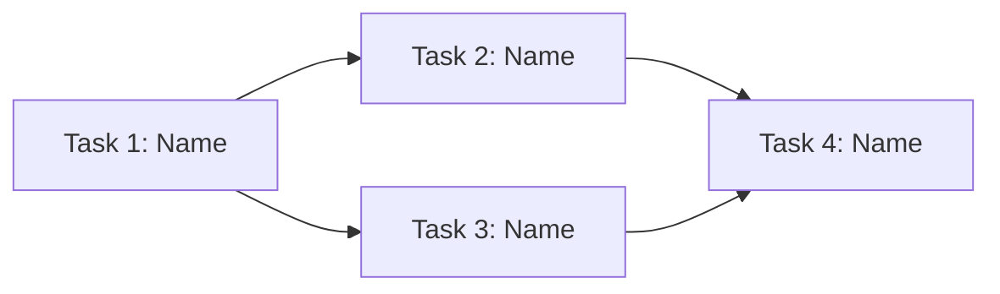

# Create New Epic

Create an epic file in `docs/tasks/` for features that span multiple tasks (L/XL complexity).

## Step 1: Read Context

**ALWAYS start by reading:**
1. `docs/system/project-context.md` — Dense project summary (if it exists)
2. `docs/templates/epic.md` — Epic template to use
3. `docs/tasks/README.md` — Existing epics and tasks (avoid duplicates)
4. `docs/system/tech-stack.md` — Current technologies
5. `docs/architecture/README.md` — System design context
6. `docs/conventions/` — All conventions (code style, file structure, testing)

## Step 2: Gather Information

Ask the user:
- **Epic title**: Feature name (e.g., "User Authentication System")
- **Goal**: One sentence — what does the user/system gain when this is complete?
- **Priority**: P0 | P1 | P2 | P3
- **Target date**: Optional deadline
- **Constraints**: Performance, compatibility, scope boundaries

## Step 3: Generate Metadata

1. **Find next epic number**: Scan `docs/tasks/EPIC-*.md` filenames, extract the number from `EPIC-{N}-...`, find the highest N, use N+1. If none exist, start at 1.
2. **Filename**: `EPIC-{N}-{kebab-name}.md`
   - Example: "User Authentication System" — `EPIC-1-user-auth-system.md`
3. **Frontmatter**: Set `phase: plan`, `status: planning`, priority, today's date
4. **Date**: Today's date

## Step 4: Deep Analysis

Before writing the epic, deeply analyze the scope:

1. **Scan codebase**: Map all areas the epic will touch
2. **Identify boundaries**: What's in scope vs. out of scope?
3. **Find existing patterns**: How similar features are structured in the codebase
4. **Map dependencies**: External services, existing features, data requirements
5. **Assess risk**: What's uncertain? What could go wrong?

## Step 5: Decompose into Tasks

This is the critical step. Break the epic into **self-contained tasks**:

### Rules for Task Decomposition

1. **Each task ships independently** — Produces a working increment
2. **Each task is M complexity** — If larger, break it further
3. **Minimize cross-task dependencies** — Prefer vertical slices over horizontal layers
4. **Order by dependency** — First task has zero dependencies

### Decomposition Strategies

Pick the best strategy for this epic:

| Strategy | When to Use | Example |
|----------|------------|---------|
| **Vertical slice** | User-facing features | "User can register" > "User can login" > "User can reset password" |
| **By layer** | Infrastructure work | "Schema setup" > "API layer" > "UI layer" |
| **By risk** | Uncertain requirements | "Spike/prototype" > "Core implementation" > "Polish" |
| **By component** | Multi-component changes | "Auth module" > "Payment module" > "Notification module" |

### For Each Task, Define

- **Title**: Action-oriented, one line
- **Acceptance criteria**: 2-5 testable conditions
- **Subtasks**: S complexity each (single concern), tagged `[DEV]`/`[TEST]`/`[DOCS]`
- **Dependencies**: Which other tasks must complete first
- **Files affected**: Exact paths from codebase scan

## Step 6: Build Dependency Graph

Create a Mermaid diagram showing task execution order:



## Step 7: Create Epic File

Save to `docs/tasks/EPIC-{N}-{kebab-name}.md` using the template from `docs/templates/epic.md`.

Fill in the YAML frontmatter with actual values. Fill in the Problem Statement, Goal, Success Criteria, Solution Overview, Dependency Graph, and Risks sections. For the Task Breakdown table, fill in task names, complexity, priority, and dependencies — file links will be filled in Step 8.

## Step 8: Create Separate Task Files

For **each task** identified in Step 5, create a separate task file:

1. **Find next task number**: Scan `docs/tasks/TASK-*.md`, extract highest N, increment for each task
2. **Filename**: `TASK-{N}-E{epicN}-{kebab-name}.md` (where `epicN` is this epic's number)
3. **Create each file** from `docs/templates/task-prd.md` with:
   - YAML frontmatter with `epic: E{epicN}`, `phase: plan`, `status: planning`
   - **What** — one paragraph describing the task's deliverable
   - **Acceptance Criteria** — 2-5 testable conditions (from Step 5 analysis)
   - **PLAN section** — Approach, affected areas, dependencies
   - **DEV section** — Subtasks at S complexity each, tagged `[DEV]`/`[TEST]`/`[DOCS]`
   - **TEST section** — Test plan mapped to acceptance criteria
4. **Update the epic's Task Breakdown table** — fill in the actual filenames and links for each task
5. **Add each task** to `docs/tasks/README.md` in the Planning section

## Step 9: Update Task Board

Add the epic to `docs/tasks/README.md`:

```markdown
## Active Epics

| Epic | Tasks | Progress | Priority | Link |
|------|-------|----------|----------|------|
| Epic Title | 0/N done | -- | P1 | [Link](./EPIC-N-title.md) |
```

## Step 10: Present Summary

Show the user:
- Epic overview (goal + scope)
- Task count with complexity breakdown
- List of created task files with links
- Dependency graph (Mermaid)
- Key risks
- Recommended starting task

Ask: **"Epic and all task files created. Want me to start planning Task 1 (`/sk:plan`)?"**

## Validation Checklist

- [ ] Read lifecycle and template docs first
- [ ] Goal is one clear sentence
- [ ] Epic-level acceptance criteria defined
- [ ] Each task is self-contained and M complexity max
- [ ] Each task has its own separate file (`TASK-{N}-E{epicN}-{name}.md`)
- [ ] Each task file has testable acceptance criteria and subtask breakdown
- [ ] Epic's Task Breakdown table links to all task files
- [ ] Dependency graph is correct (no circular dependencies)
- [ ] Files affected are verified against codebase
- [ ] Risks and open questions documented
- [ ] Epic and all tasks added to `docs/tasks/README.md`
