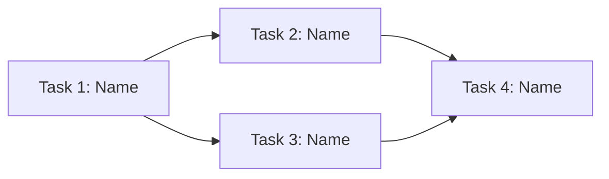

# Create New Epic

Create an epic file in `docs/tasks/` for features that span multiple tasks (>2 days of work).

## Step 1: Read Context

**ALWAYS start by reading:**
1. `docs/lifecycle/README.md` — Task hierarchy and decomposition rules
2. `docs/templates/epic.md` — Epic template to use
3. `docs/tasks/README.md` — Existing epics and tasks (avoid duplicates)
4. `docs/system/tech-stack.md` — Current technologies
5. `docs/architecture/README.md` — System design context
6. `docs/conventions/` — All conventions (code style, file structure, testing)

## Step 2: Gather Information

Ask the user:
- **Epic title**: Feature name (e.g., "User Authentication System")
- **Goal**: One sentence — what does the user/system gain when this is complete?
- **Priority**: P0 | P1 | P2 | P3
- **Target date**: Optional deadline
- **Constraints**: Performance, compatibility, scope boundaries

## Step 3: Generate Metadata

1. **Find next ID**: Search `docs/tasks/` for `EPIC-` files, determine next sequential name
2. **Filename**: `EPIC-kebab-case-title.md`
3. **Date**: Today's date

## Step 4: Deep Analysis

Before writing the epic, deeply analyze the scope:

1. **Scan codebase**: Map all areas the epic will touch
2. **Identify boundaries**: What's in scope vs. out of scope?
3. **Find existing patterns**: How similar features are structured in the codebase
4. **Map dependencies**: External services, existing features, data requirements
5. **Assess risk**: What's uncertain? What could go wrong?

## Step 5: Decompose into Tasks

This is the critical step. Break the epic into **self-contained tasks**:

### Rules for Task Decomposition

1. **Each task ships independently** — Produces a working increment
2. **Each task is 1-2 days** — If longer, break it further
3. **Minimize cross-task dependencies** — Prefer vertical slices over horizontal layers
4. **Order by dependency** — First task has zero dependencies

### Decomposition Strategies

Pick the best strategy for this epic:

| Strategy | When to Use | Example |
|----------|------------|---------|
| **Vertical slice** | User-facing features | "User can register" → "User can login" → "User can reset password" |
| **By layer** | Infrastructure work | "Schema setup" → "API layer" → "UI layer" |
| **By risk** | Uncertain requirements | "Spike/prototype" → "Core implementation" → "Polish" |
| **By component** | Multi-component changes | "Auth module" → "Payment module" → "Notification module" |

### For Each Task, Define

- **Title**: Action-oriented, one line
- **Acceptance criteria**: 2-5 testable conditions
- **Subtasks**: ≤ 4h each, tagged `[DEV]`/`[TEST]`/`[DOCS]`
- **Dependencies**: Which other tasks must complete first
- **Files affected**: Exact paths from codebase scan

## Step 6: Build Dependency Graph

Create a Mermaid diagram showing task execution order:



## Step 7: Create Epic File

Save to `docs/tasks/EPIC-kebab-case-title.md` using the template from `docs/templates/epic.md`.

Fill in all sections completely. The epic should be a complete project plan.

## Step 8: Update Task Board

Add the epic to `docs/tasks/README.md`:

```markdown
## Active Epics

| Epic | Tasks | Progress | Priority | Link |
|------|-------|----------|----------|------|
| Epic Title | 0/N done | 🔴 | P1 | [Link](./EPIC-title.md) |
```

## Step 9: Present Summary

Show the user:
- Epic overview (goal + scope)
- Task count with total estimate
- Dependency graph (Mermaid)
- Key risks
- Recommended starting task

Ask: **"Want me to start with Task 1? I'll create its detailed task file."**

## Validation Checklist

- [ ] Read lifecycle and template docs first
- [ ] Goal is one clear sentence
- [ ] Epic-level acceptance criteria defined
- [ ] Each task is self-contained and 1-2 days max
- [ ] Each task has testable acceptance criteria
- [ ] Dependency graph is correct (no circular dependencies)
- [ ] Files affected are verified against codebase
- [ ] Risks and open questions documented
- [ ] Added to `docs/tasks/README.md`
