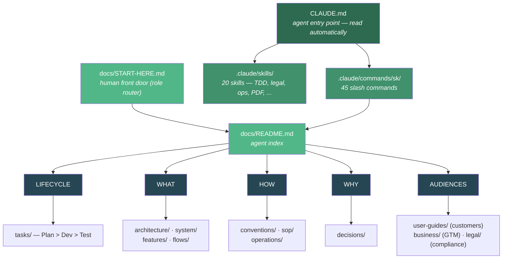
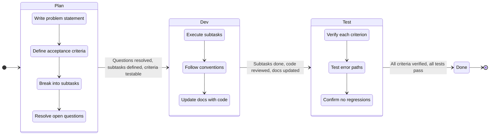
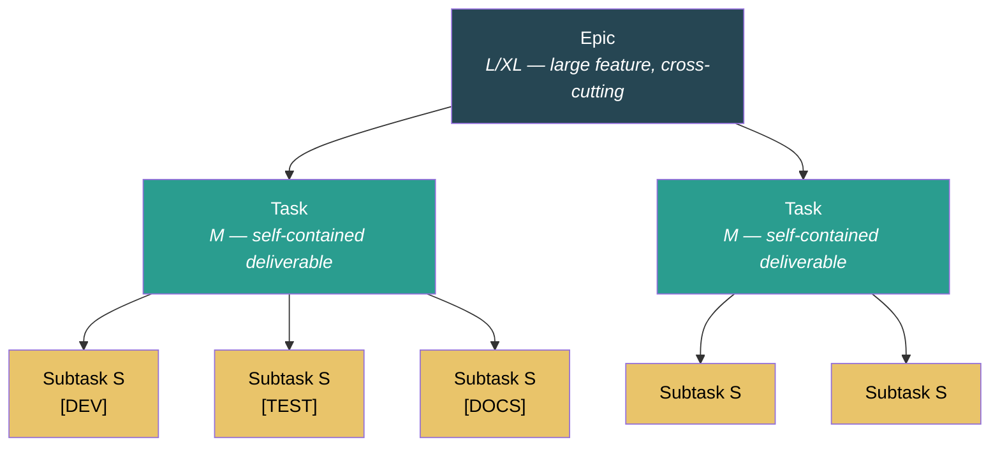
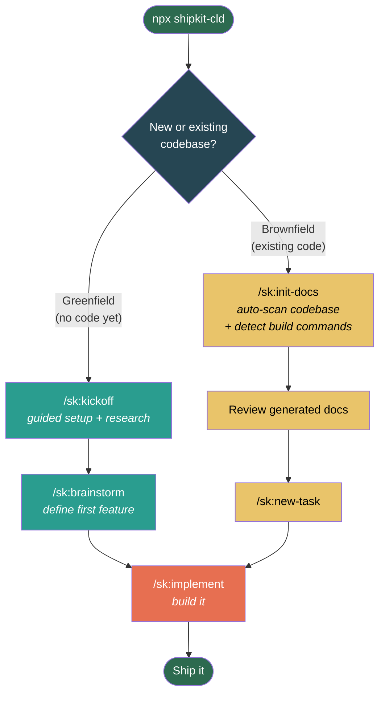
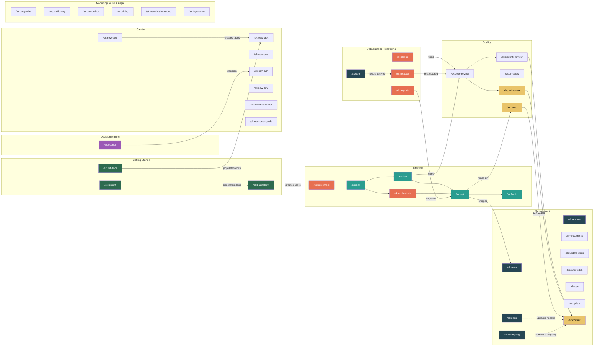

# SK — Documentation & Lifecycle System for Claude Code

## Why This Exists

Claude Code (and any AI coding agent) works dramatically better when it has structured context about your project's conventions, architecture, and procedures. Without it, you get inconsistent code style, forgotten edge cases, and repeated mistakes across sessions.

SK solves two problems:

1. **Procedural context** -- Conventions, file structure, testing patterns, and step-by-step workflows so the agent follows your project's rules instead of inventing its own.
2. **Behavioral guardrails** -- Principles that govern *how* the agent thinks: surface assumptions before coding, do exactly what was asked, keep solutions simple, verify goals with evidence, and track deliberate shortcuts (see `docs/conventions/coding-behavior.md`).

**Beyond engineering.** SK extends the same discipline to the whole software-company doc surface — dedicated homes and tooling for **end-user guides**, **business / GTM** (positioning, competitors, pricing), **legal & compliance**, and **operations** (runbooks, incidents, postmortems) — plus two domain experts (`/sk:legal-scan`, `/sk:ops`), document **lifecycle** tracking, a read-only coherence **audit** (`/sk:docs-audit`), and one-command **PDF export**.

## What Gets Installed

```
your-project/
├── CLAUDE.md                    ← Agent reads this first (slim, ~100 lines)
├── .claude/
│   ├── commands/sk/             ← 45 slash commands
│   ├── agents/                  ← 8 agents (implementer, reviewers, debugger, dependency-analyzer)
│   └── skills/                  ← 20 skills (TDD, legal, ops, PDF, copywriting, diagrams, ...)
└── docs/                        ← Documentation hub (multi-audience)
    ├── START-HERE.md            Human front door (role-based router)
    ├── README.md                Agent index
    ├── architecture/ system/    Engineering: design + current state
    ├── conventions/ sop/        How to work: standards + procedures
    ├── features/                Per-feature / subsystem docs
    ├── user-guides/             Customer-facing guides
    ├── business/                Positioning, competitors, pricing
    ├── legal/                   Agreements, policies, compliance scans
    ├── operations/              Runbooks, incidents, postmortems
    ├── tasks/ decisions/ flows/ reviews/ research/ reference/  + _archive/
    ├── templates/               19 starter templates
    └── commands-reference.md    Full command table (loaded on demand)
```

## How It Works



**LIFECYCLE** = How work flows from idea to done (plan > dev > test, task hierarchy)
**WHAT** = What the system looks like (architecture, current state, features, diagrams)
**HOW** = How to work in and run it (coding rules, procedures, ops runbooks)
**WHY** = Why things are the way they are (decision records)
**AUDIENCES** = Who else the docs serve — customers, business/GTM, legal/compliance

## Task Lifecycle

Every piece of work flows through three phases with explicit exit gates:



**Quick Path (XS/S complexity):** Most work doesn't need task files. Just describe what you want — Claude Code follows Plan > Dev > Test mentally and commits when done.

**Formal lifecycle (M+ complexity):** Create a task file, go through each phase with exit gates.

### Task Hierarchy



## Installation

```bash
# From your project root:
npx shipkit-cld

# Or targeting a specific directory:
npx shipkit-cld /path/to/my-project
```

## Updating

Three ways to update after SK has been changed:

```bash
# 1. From npm (latest published version):
npx shipkit-cld@latest update .

# 2. From a local SK checkout (explicit):
npx shipkit-cld update . --from /path/to/sk

# 3. Automatic (if installed from local checkout, source path is remembered):
npx shipkit-cld update .
```

Updates overwrite SK system files (commands, agents, skills, templates, SOPs) but **preserve your project content** (tasks, conventions, system docs, architecture, decisions, flows).

Your `CLAUDE.md` is **never overwritten**. If you already have one when you install, SK leaves it untouched and drops its template alongside as `CLAUDE.sk.md` for you to merge. Only a greenfield install (no existing `CLAUDE.md`) creates one for you.

The source path is saved to `.claude/.sk-source` during install, so subsequent updates find it automatically.

```bash
# Remove SK (keeps your docs/):
npx shipkit-cld remove .
```

## Getting Started

SK works with both new projects and existing codebases. The setup path differs.



### Greenfield Project (starting from scratch)

```
1. npx shipkit-cld                          # Install SK
2. /sk:kickoff                              # Answer questions, docs auto-generated
3. /sk:brainstorm                           # Describe your first feature, get epic + tasks
4. /sk:implement                            # Build it
```

`/sk:kickoff` is a guided conversation that asks what you're building, what stack you want, and what the core features are. It then **researches current best practices** for your chosen stack (latest versions, recommended project structure, naming conventions, common pitfalls) and generates all foundation docs automatically:

- `docs/system/tech-stack.md` — with current stable versions from research
- `docs/system/project-context.md` — dense project summary
- `docs/conventions/code-style.md` — conventions for your chosen language/framework
- `docs/conventions/file-structure.md` — recommended project layout
- `docs/conventions/testing.md` — test patterns for your stack
- `CLAUDE.md` Build Commands — filled in for your stack
- ADRs for your major stack choices

`/sk:brainstorm` then takes your first feature idea, explores it through conversation, optionally researches domain patterns ("what do similar apps typically include?"), and produces a structured epic with tasks — ready for `/sk:implement`.

**No manual file editing required.** Both commands generate everything through conversation.

### Brownfield Project (existing codebase)

```
1. npx shipkit-cld                          # Install SK
2. /sk:init-docs                            # Auto-scan codebase, detect build commands, populate docs
3. Review generated docs                    # Verify accuracy, fix anything wrong
4. /sk:new-task                             # Define your first piece of work
5. /sk:implement                            # Build it
```

`/sk:init-docs` scans your codebase and generates:
- `docs/system/tech-stack.md` — from `package.json`, `pyproject.toml`, etc.
- `docs/system/project-context.md` — dense project summary
- `docs/system/database-schema.md` — from schema/model files
- `docs/system/api-reference.md` — from route definitions
- `docs/conventions/code-style.md` — from observed naming and formatting patterns
- `docs/conventions/file-structure.md` — from actual project layout
- `docs/architecture/README.md` — component map from directory structure
- ADRs for 2-3 major tech choices it discovers

**Build commands are auto-detected** from `package.json` scripts, `Makefile` targets, `pyproject.toml` tools, `Cargo.toml`, `go.mod`, and CI workflows. You only need to fill in commands marked `[NOT DETECTED]`.

**Tip:** Run `/sk:update-docs` periodically to keep docs in sync as your codebase evolves.

### Session Continuity

SK tracks your active work across sessions:

- **`docs/tasks/.current`** — automatically updated by lifecycle commands with your active task, phase, and subtask progress
- **`/sk:resume`** — start a new session with a briefing: what you were working on, what's next, any uncommitted changes
- **Claude Code memory** — user preferences and workflow patterns persist across sessions automatically

## Command Map



## Command Reference

### Getting Started

| Command | Purpose | When to Use |
|---------|---------|-------------|
| `/sk:kickoff` | Guided project setup + best-practice research | Starting a new (greenfield) project |
| `/sk:brainstorm` | Explore idea, produce epic + tasks | Have an idea, need to break it down |
| `/sk:init-docs` | Auto-scan codebase, populate docs | Brownfield project or full rebuild |

### Lifecycle (Plan > Dev > Test)

| Command | Purpose | When to Use |
|---------|---------|-------------|
| `/sk:implement` | Full lifecycle: Plan > Dev > Test | Build a feature end-to-end |
| `/sk:plan` | Complete PLAN phase | Break down and prepare a task |
| `/sk:dev` | Execute DEV phase | Implement subtasks for a task |
| `/sk:test` | Execute TEST phase | Verify acceptance criteria |
| `/sk:finish` | Review + commit + push + PR + task update | After work is done, ready to ship |
| `/sk:orchestrate` | Parallel agent team — dependency-aware | 3+ independent subtasks, want parallelism |

### Decision Making

| Command | Purpose | When to Use |
|---------|---------|-------------|
| `/sk:council` | Multi-persona advisory council (3-5 personas, structured debate) | Architecture decisions, strategy, trade-offs |

### Document Creation

| Command | Purpose | Output |
|---------|---------|--------|
| `/sk:new-task` | Create a new task file | `docs/tasks/TASK-{N}-*.md` |
| `/sk:new-epic` | Create a new epic + child tasks | `docs/tasks/EPIC-{N}-*.md` |
| `/sk:new-sop` | Create a standard operating procedure | `docs/sop/*.md` |
| `/sk:new-adr` | Record an architecture decision | `docs/decisions/*.md` |
| `/sk:new-flow` | Create a flow diagram (SVG or Mermaid) | `docs/flows/*.svg` or `*.md` |
| `/sk:new-feature-doc` | Document a feature/subsystem, verified against code | `docs/features/*.md` |
| `/sk:new-user-guide` | Write a customer-facing, task-oriented guide | `docs/user-guides/*.md` |

### Quality & Review

| Command | Purpose | Output |
|---------|---------|--------|
| `/sk:review` | Parallel multi-dimension review — security, perf, quality subagents | Merged report with ship/no-ship verdict |
| `/sk:code-review` | Analyze code for bugs, conventions, quality | Report (conversation) |
| `/sk:security-review` | OWASP Top 10, secrets, dependency audit | Report (conversation) |
| `/sk:ui-review` | Accessibility, responsive design, UX | Report (conversation) |
| `/sk:perf-review` | Queries, memory, rendering, caching | Report (conversation) |
| `/sk:recap` | Reviewer-facing recap of a diff — what changed and why | Report (conversation, optional save) |

### Debugging & Refactoring

| Command | Purpose | Output |
|---------|---------|--------|
| `/sk:debug` | Reproduce, isolate, fix, verify with regression test | Code fix + test + task file (M+) |
| `/sk:refactor` | Restructure code, verify behavior unchanged | Code changes + task file (M+) |
| `/sk:migrate` | Handle breaking changes, dependency upgrades, DB migrations | Safe migration with rollback plan |
| `/sk:debt` | Harvest `sk-debt` markers into a ranked ledger | Tech-debt ledger (optional save) |

### Git & Release

| Command | Purpose | Output |
|---------|---------|--------|
| `/sk:commit` | Smart git commit + push + PR | Git commit |
| `/sk:pr` | Create a pull request from the current branch | PR URL |
| `/sk:changelog` | Generate changelog from git history | `CHANGELOG.md` |
| `/sk:release` | Version bump + changelog + tag + GitHub release | Tagged release |

### Session & Management

| Command | Purpose | When to Use |
|---------|---------|-------------|
| `/sk:resume` | Session briefing + context restore | Starting a new session with active work |
| `/sk:task-status` | Show task board overview | Check progress across all tasks |
| `/sk:update-docs` | Sync docs with codebase | After changes, or periodic audit |
| `/sk:docs-audit` | Audit doc coherence — orphans, staleness, broken links, lifecycle | Periodic doc health check, before release |
| `/sk:ops` | Operations/SRE expert — incidents, runbooks, postmortems, SLOs, readiness | Running prod, on-call, reliability work |
| `/sk:deps` | Dependency health check | Periodic audit or before release |
| `/sk:retro` | Run a retrospective on completed work | Capture lessons, patterns, improvements |
| `/sk:update` | Update SK commands & templates | Get latest version (npm or local) |

### Marketing, GTM & Legal

| Command | Purpose | When to Use |
|---------|---------|-------------|
| `/sk:copywrite` | Write marketing copy — landing pages, emails, ads, CTAs | Any SaaS/tech marketing copy task |
| `/sk:positioning` | Define positioning & messaging (ICP, category, value prop) | Establishing GTM foundation |
| `/sk:competitor` | Analyze competitors — profiles, positioning map, comparison | Competitive intelligence |
| `/sk:pricing` | Design or evaluate pricing — value metric, model, tiers | Pricing decisions |
| `/sk:new-business-doc` | Create a business doc (plan, model, cap table, update, memo) | Capturing a business artifact |
| `/sk:legal-scan` | Legal & compliance expert — requirements, framework deep-dives, document drafting, contract review | Starting a project, adding payments, fundraising |

## Package Structure

SK separates the **product** (what gets installed) from **project files** (for developing SK itself):

```
sk/                              ← SK source repository
├── CLAUDE.md                    ← SK development instructions (NOT shipped)
├── cli.mjs                      ← CLI: install / update / remove
├── package.json                 ← npm package config
├── pkg/                         ← Everything shipped to target projects
│   ├── CLAUDE.md                ← Template CLAUDE.md installed into projects
│   ├── docs/                    ← Template documentation tree
│   └── .claude/                 ← Commands, agents, skills
│       ├── commands/sk/         ← 45 slash commands
│       ├── agents/              ← Implementer, reviewers, dependency-analyzer, architecture-reviewer
│       └── skills/              ← TDD, diagrams, escalation, legal, subagent-dev, verification, worktrees, copywriting, technical-writing, error-recovery, context-priming, plow-ahead, stay-within-limits, competitor-analysis, pricing-strategy, product-marketing-context, operations-advisor, create-pdf
└── .claude/                     ← Development copy (dogfooding, not shipped)
```

## Key Design Decisions

**Plan > Dev > Test lifecycle** — Forces thinking before coding. Each phase has an explicit exit gate so nothing gets skipped. The 3-phase cycle is simple enough to actually follow.

**Quick Path as default** — Most work is XS/S complexity. The formal lifecycle exists for M+ work but the default is "just do it" with mental guardrails.

**Lazy-loaded context** — Commands only read the docs they need for the current phase, not everything upfront. This keeps context windows lean and response times fast.

**Session continuity** — `.current` file + `/sk:resume` command + memory integration means you never lose context between sessions.

**Task hierarchy (Epic > Task > Subtask)** — Epics break into tasks, tasks break into subtasks. Each level has a clear scope and complexity ceiling. Subtasks capped at S complexity (single concern) prevent scope creep and make progress visible.

**Self-contained tasks** — Every task is independently buildable, testable, and shippable. Claude Code can execute a task without needing context from other in-flight work.

**Source path persistence** — `.claude/.sk-source` remembers where SK was installed from, so local development changes flow to target projects with a simple `update` command.

**Worked examples over abstract docs** — The `examples/` folder shows exactly what a completed task looks like. Worth more than pages of explanation.

**Templates over empty files** — Every doc type has a template. Copy, fill in, done. No blank page anxiety.

**SVG + Mermaid for diagrams** — SVG diagrams (via the `technical-diagrams` skill) for polished architecture and flow visuals with a consistent design system. Mermaid for quick sequences, ER diagrams, and state charts that render natively in GitHub. Both live in git alongside code.

**ADRs for decisions** — "Why did we choose X?" is the most expensive question in a codebase. ADRs answer it once.

**SOPs for procedures** — AI agents follow explicit steps better than vague guidelines. SOPs eliminate improvisation on critical tasks.

**Parallel orchestration** — `/sk:orchestrate` analyzes subtask dependencies, builds a file-conflict graph, groups independent subtasks into waves, and dispatches parallel subagents with worktree isolation. Two-stage review (spec + quality) runs per agent. Merges wave results sequentially with conflict detection. Caps at 4 parallel agents (research-backed sweet spot).

**Advisory council** — `/sk:council` convenes 3-5 AI personas with genuinely incompatible value systems (pragmatist vs architect vs adversary) to debate strategic questions. Structured rounds: independent positions (zero cross-visibility), challenge, optional rebuttal, synthesis. Produces a decision report with recommendation, confidence, dissent, and conditions for reversal. A plan-arbiter mode resolves competing plans via a ranked tiebreaker instead of blending them. Research shows multi-agent debate reduces hallucinations by 30%+ and improves factual accuracy.

**Behavioral guardrails** — LLMs over-engineer, make hidden assumptions, and drift from scope. Five principles (surface assumptions, do exactly what's asked, keep it simple, verify with evidence, track deliberate shortcuts via `sk-debt` markers) are embedded in every lifecycle command to counteract this. See `docs/conventions/coding-behavior.md`.

## Anti-Patterns to Avoid

| Don't | Do Instead |
|-------|-----------|
| Write 20-page architecture docs | Keep each doc focused, link between them |
| Document implementation details | Document decisions and interfaces |
| Let docs go stale | Update in the same PR as the code change |
| Duplicate content across docs | Link to the single source of truth |
| Write docs nobody reads | Write docs Claude Code reads every session |
| Add features "while you're in the file" | Stick to the task scope, note improvements as follow-ups |
| Build for hypothetical future needs | Implement the simplest thing that satisfies the acceptance criteria |
| Mark criteria as "works" or "done" | Verify with specific evidence ("returns 201 with {id, email}") |
