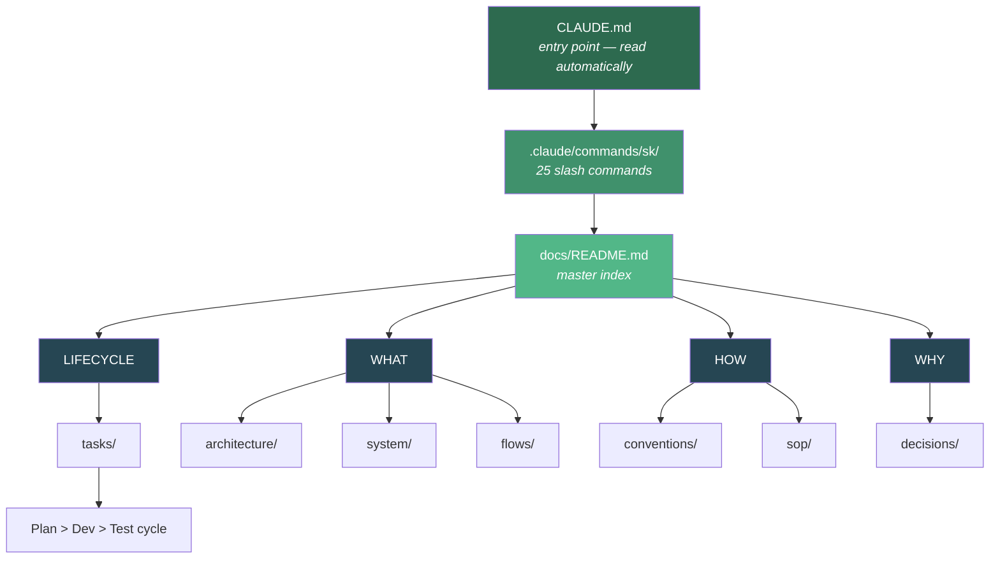
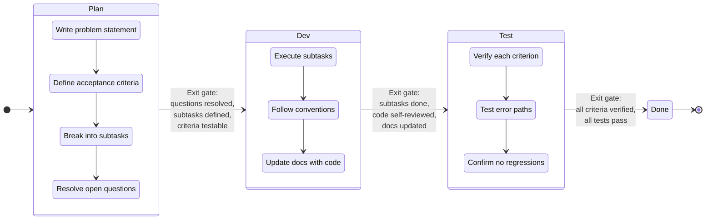
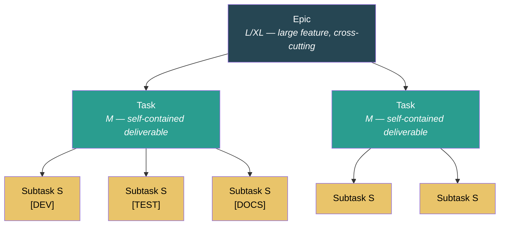
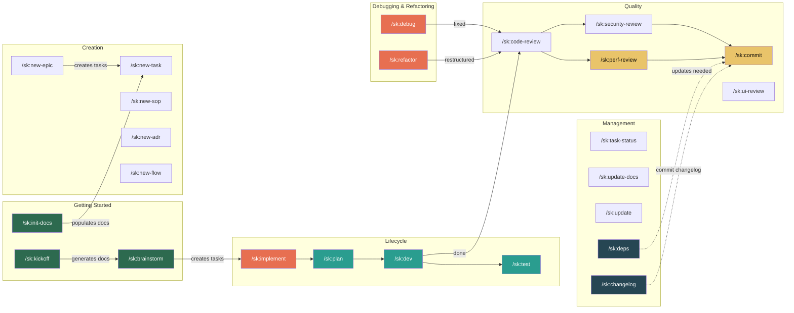

# SK — Documentation & Lifecycle System for Claude Code

## Why This Exists

Claude Code (and any AI coding agent) works dramatically better when it has structured context about your project's conventions, architecture, and procedures. This system gives it that context through a lightweight, maintainable doc structure.

## How It Works



**LIFECYCLE** = How work flows from idea to done (plan > dev > test, task hierarchy)
**WHAT** = What the system looks like (architecture, current state, diagrams)
**HOW** = How to work in it (coding rules, procedures)
**WHY** = Why things are the way they are (decision records)

## Task Lifecycle

Every piece of work flows through three phases with explicit exit gates:



### Task Hierarchy



## Installation

```bash
# From your project root:
npx shipkit-cld

# Or targeting a specific directory:
npx shipkit-cld /path/to/my-project
```

## Getting Started

SK works with both new projects and existing codebases. The setup path differs.


### Greenfield Project (starting from scratch)

You have no code yet — you're setting up the project structure and want Claude Code to follow good practices from the start.

```
1. npx shipkit-cld                          # Install SK
2. /sk:kickoff                              # Answer questions, docs auto-generated
3. /sk:brainstorm                           # Describe your first feature, get epic + tasks
4. /sk:implement                            # Build it
```

`/sk:kickoff` is a guided conversation that asks what you're building, what stack you want, and what the core features are. It then **researches current best practices** for your chosen stack (latest versions, recommended project structure, naming conventions, common pitfalls) and generates all foundation docs automatically:

- `docs/system/tech-stack.md` — with current stable versions from research
- `docs/system/project-context.md` — dense project summary
- `docs/conventions/code-style.md` — conventions for your chosen language/framework
- `docs/conventions/file-structure.md` — recommended project layout
- `docs/conventions/testing.md` — test patterns for your stack
- `CLAUDE.md` Build Commands — filled in for your stack
- ADRs for your major stack choices

`/sk:brainstorm` then takes your first feature idea, explores it through conversation, optionally researches domain patterns ("what do similar apps typically include?"), and produces a structured epic with tasks — ready for `/sk:implement`.

**No manual file editing required.** Both commands generate everything through conversation.

### Brownfield Project (existing codebase)

You have an existing codebase — you want Claude Code to understand it and follow its patterns.

```
1. npx shipkit-cld                          # Install SK
2. /sk:init-docs                            # Auto-scan codebase, detect build commands, populate docs
3. Review generated docs                    # Verify accuracy, fix anything wrong
4. /sk:new-task                             # Define your first piece of work
5. /sk:implement                            # Build it
```

`/sk:init-docs` scans your codebase and generates:
- `docs/system/tech-stack.md` — from `package.json`, `pyproject.toml`, etc.
- `docs/system/project-context.md` — dense project summary
- `docs/system/database-schema.md` — from schema/model files
- `docs/system/api-reference.md` — from route definitions
- `docs/conventions/code-style.md` — from observed naming and formatting patterns
- `docs/conventions/file-structure.md` — from actual project layout
- `docs/architecture/README.md` — component map from directory structure
- ADRs for 2-3 major tech choices it discovers

**What to review after init:** The auto-generated docs are best-effort. Skim each one and correct anything wrong — especially conventions and architecture docs. These are what Claude Code reads before every task, so accuracy matters.

**Build commands are auto-detected** from `package.json` scripts, `Makefile` targets, `pyproject.toml` tools, `Cargo.toml`, `go.mod`, and CI workflows. The report shows what was detected and what's missing. You only need to fill in commands marked `[NOT DETECTED]`.

**What to review manually:**
- `docs/conventions/code-style.md` — add any unwritten rules the scan couldn't detect
- `docs/system/project-context.md` — add gotchas, in-progress work, team context

**Tip:** Run `/sk:update-docs` periodically to keep docs in sync as your codebase evolves.

## Command Map



## Command Reference

### Getting Started

| Command | Purpose | When to Use |
|---------|---------|-------------|
| `/sk:kickoff` | Guided project setup + best-practice research | Starting a new (greenfield) project |
| `/sk:brainstorm` | Explore idea, produce epic + tasks | Have an idea, need to break it down |
| `/sk:init-docs` | Auto-scan codebase, populate docs | Brownfield project or full rebuild |

### Lifecycle (Plan > Dev > Test)

| Command | Purpose | When to Use |
|---------|---------|-------------|
| `/sk:implement` | Full lifecycle: Plan > Dev > Test | Build a feature end-to-end |
| `/sk:plan` | Complete PLAN phase | Break down and prepare a task |
| `/sk:dev` | Execute DEV phase | Implement subtasks for a task |
| `/sk:test` | Execute TEST phase | Verify acceptance criteria |

### Document Creation

| Command | Purpose | Output |
|---------|---------|--------|
| `/sk:new-task` | Create a new task file | `docs/tasks/TASK-{N}-*.md` |
| `/sk:new-epic` | Create a new epic + child tasks | `docs/tasks/EPIC-{N}-*.md` |
| `/sk:new-sop` | Create a standard operating procedure | `docs/sop/*.md` |
| `/sk:new-adr` | Record an architecture decision | `docs/decisions/*.md` |
| `/sk:new-flow` | Create a Mermaid flow diagram | `docs/flows/*.md` |

### Quality & Review

| Command | Purpose | Output |
|---------|---------|--------|
| `/sk:code-review` | Analyze code for bugs, conventions, quality | Report (conversation) |
| `/sk:security-review` | OWASP Top 10, secrets, dependency audit | Report (conversation) |
| `/sk:ui-review` | Accessibility, responsive design, UX | Report (conversation) |
| `/sk:perf-review` | Queries, memory, rendering, caching | Report (conversation) |

### Debugging & Refactoring

| Command | Purpose | Output |
|---------|---------|--------|
| `/sk:debug` | Reproduce, isolate, fix, verify with regression test | Code fix + test + task file (M+) |
| `/sk:refactor` | Restructure code, verify behavior unchanged | Code changes + task file (M+) |

### Git & Release

| Command | Purpose | Output |
|---------|---------|--------|
| `/sk:commit` | Smart git commit + push + PR | Git commit |
| `/sk:changelog` | Generate changelog from git history | `CHANGELOG.md` |

### Management

| Command | Purpose | When to Use |
|---------|---------|-------------|
| `/sk:task-status` | Show task board overview | Check progress across all tasks |
| `/sk:update-docs` | Sync docs with codebase | After changes, or periodic audit |
| `/sk:deps` | Dependency health check | Periodic audit or before release |
| `/sk:update` | Update SK commands & templates | Get latest version of shipkit-cld |

## Key Design Decisions

**Plan > Dev > Test lifecycle** — Forces thinking before coding. Each phase has an explicit exit gate so nothing gets skipped. The 3-phase cycle is simple enough to actually follow.

**Task hierarchy (Epic > Task > Subtask)** — Epics break into tasks, tasks break into subtasks. Each level has a clear scope and complexity ceiling. Subtasks capped at S complexity (single concern) prevent scope creep and make progress visible.

**Self-contained tasks** — Every task is independently buildable, testable, and shippable. This means Claude Code can execute a task without needing context from other in-flight work.

**Worked examples over abstract docs** — The `examples/` folder shows exactly what a completed task looks like. Worth more than pages of explanation.

**Templates over empty files** — Every doc type has a template. Copy, fill in, done. No blank page anxiety.

**Mermaid for diagrams** — Renders in GitHub, VS Code, and most tools. No external diagram software needed. Lives in git alongside code.

**ADRs for decisions** — "Why did we choose X?" is the most expensive question in a codebase. ADRs answer it once.

**SOPs for procedures** — AI agents follow explicit steps better than vague guidelines. SOPs eliminate improvisation on critical tasks.

**Flat over deep** — Two levels max. Everything discoverable from the README index.

## Anti-Patterns to Avoid

| Don't | Do Instead |
|-------|-----------|
| Write 20-page architecture docs | Keep each doc focused, link between them |
| Document implementation details | Document decisions and interfaces |
| Let docs go stale | Update in the same PR as the code change |
| Duplicate content across docs | Link to the single source of truth |
| Write docs nobody reads | Write docs Claude Code reads every session |
