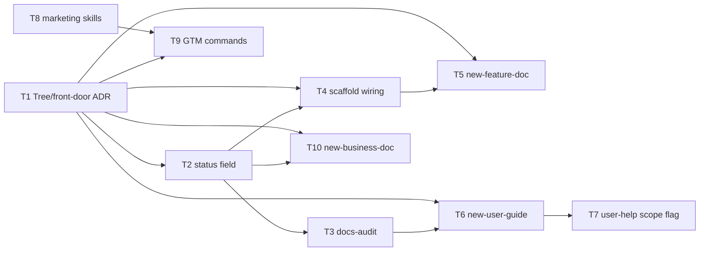

# SK Enhancement Plan — Documentation System & Multi-Audience Docs

> **Status:** proposal · **Target release:** v1.8.0 · **Last updated:** 2026-06-27
> **Source:** reconciled from LegalAnalytics `EPIC-6-sk-library-enhancements`, corrected against the current `shipkit-cld@1.7.0` package.

---

## 1. Why

The current SK doc system (`/sk:init-docs`, `/sk:update-docs`, 13-section tree) is engineer-facing and has **no coherence enforcement** and **no lifecycle signal**. Two real gaps:

1. **No way to detect doc rot** — orphaned files, broken cross-links, stale docs. Nothing flags them.
2. **No multi-audience surface** — every doc targets the AI pair / engineer. Projects that also need feature docs, business docs, or end-user guides reinvent the structure each time.

This plan closes both, **portably** (everything ships in `pkg/`, propagates via `cli.mjs update`).

## 2. Standing constraints (apply to every item below)

These are SK-specific rules the source epic omitted. They are non-negotiable for every task here:

- **Dual-write.** Every command/skill/template change lands in **both** root `.claude/` and `pkg/.claude/` (and `pkg/docs/` for templates). A task isn't done until both copies match. Add a sync-check to each DEV gate.
- **Invocation discipline.** Classify every new command/skill model-invoked vs user-invoked. Doc-authoring commands (`new-*`, GTM) are **user-invoked** → set `disable-model-invocation: true` and a one-line description, so they cost no per-turn context.
- **Distribution is already solved.** Propagation = `cli.mjs update` + `update.md`'s SK-authored-doc refresh. Do **not** invent a sync mechanism; extend the existing one and mark new files as library-owned.
- **Language/framework agnostic.** No repo-specific paths or content in any shipped file.
- **`pkg/CLAUDE.md` stays < 100 lines.** Don't grow the bootstrap template; new behavior lives in commands/skills.

## 3. Scope decisions (corrections vs the source epic)

| Source epic premise | Reality in `shipkit-cld@1.7.0` | Decision |
|---|---|---|
| Remove "stale `.agent`-targeting update-docs boilerplate" | No `.agent` refs exist anywhere — already clean | **Dropped.** Replace with a verification step only. |
| GTM wrappers are "thin wrappers over existing skills" | Only `copywriting` exists; no competitor/pricing/positioning skills | **Re-scoped:** authoring 3 skills is required work, not thin wrappers. Deferred to Phase 3. |
| "Document ADR-011's rules in the library" | ADR-011 is a LegalAnalytics artifact, absent from SK | **Reframed** as a new SK ADR via `/sk:new-adr`. |
| "Decide sync mechanism (submodule/script/package)" | npm package + `cli.mjs` already does this | **Dropped** as an open question; extend `update.md`. |
| New homes `features/ business/ user-guides/ _archive/` | SK already has a 13-section tree incl. `architecture/` | **Reconcile first** (see Phase 1, T1). |

## 4. Phased plan

Split into three phases by value and risk. **Phase 1 + 2 are the recommended v1.8.0.** Phase 3 (business/GTM) is speculative and can be a later release.

### Phase 1 — Doc coherence (high value, low risk) → v1.8.0

| # | Item | Size | Depends | Notes |
|---|------|------|---------|-------|
| T1 | ✅ **Front-door + tree reconciliation design** (ADR) | S | — | **Done.** `docs/decisions/ADR-001-doc-system-model.md` (SK-internal, not shipped): two front doors (`README.md` agent + `START-HERE.md` human), new homes `features/`/`user-guides/`/`_archive/`, `features/` complements `architecture/`, `business/` deferred to Phase 3. |
| T2 | ✅ **`Lifecycle` field** on evergreen templates + convention doc + README principle | M | — | **Done.** Named `Lifecycle` (not `status`) to avoid collision with task/epic `status`, ADR `Status`, review `status`. Scoped to evergreen docs only. Added `conventions/doc-lifecycle.md`; field on `component-doc`/`flow-diagram`/`sop-procedure`. |
| T3 | ✅ **`/sk:docs-audit`** — orphans, staleness, broken links, lifecycle, out-of-lane | M | T2 | **Done.** Read-only by default; `file:line` citations; 180d threshold (configurable); quantified-footer tally; exempts `templates/` + placeholders from link check. |
| T4 | ✅ **Scaffold + update wiring** | M | T1,T2 | **Done.** `init-docs` scaffolds both front doors + 3 homes; `update-docs` reads new sections, has Features/User Guides scope, and a Lifecycle pass; `cli.mjs` pre-creates the homes. |

### Phase 2 — Feature & user docs (high value) → v1.8.0

| # | Item | Size | Depends | Notes |
|---|------|------|---------|-------|
| T5 | ✅ **`/sk:new-feature-doc`** + `feature-doc` template | S | T1,T4 | **Done.** Reads context → traces code → writes `docs/features/` → indexes. Verify-against-code step (no aspirational docs). New `feature-doc.md` template (distinct from `component-doc`: feature-oriented). |
| T6 | ✅ **`/sk:new-user-guide`** + `user-guide` template | M | T1,T3 | **Done.** Thin front door over `technical-writing` with customer framing; verify-against-code step (no unshipped features); `user-guide.md` template (task-oriented). |
| T7 | ✅ **User-help maintenance** | S | T6 | **Done.** Implemented as `Features` / `User Guides` scope options on `/sk:update-docs` (no new command — avoids menu bloat), per the ADR. |

### Phase 3 — Business / GTM surface → ✅ folded into v1.8.0

| # | Item | Size | Depends | Notes |
|---|------|------|---------|-------|
| T8 | ✅ **Author 3 marketing skills** (`competitor-analysis`, `pricing-strategy`, `product-marketing-context`) | L | — | **Done.** Authored from scratch. **User-invoked** (`disable-model-invocation`) since they fire via wrapper commands — keeps per-turn context flat despite +3 skills. |
| T9 | ✅ **GTM commands** `/sk:competitor` `/sk:pricing` `/sk:positioning` + templates | M | T8,T1 | **Done.** Thin wrappers (mirror `copywrite.md`); single `docs/business/` home; templates positioning/competitor-profile/pricing-strategy. Kept one-per-skill (no `/sk:gtm` dispatcher) — only 3, menu cost acceptable. |
| T10 | ✅ **`/sk:new-business-doc`** + business templates | M | T1,T2 | **Done.** Mirrors `new-sop`. Lean templates: business-plan, financial-model, cap-table, investor-update, decision-memo — link out to live sources, no embedded numbers. |

### Cross-cutting (every phase, closed at release)

| # | Item | Size | Notes |
|---|------|------|-------|
| X1 | **Regenerate `docs/commands-reference.md`** | S | One canonical reference; every new command listed by domain. |
| X2 | **`cli.mjs update` propagation check** | S | Confirm new files/templates are treated as library-owned and refresh on update without clobbering project content. |
| X3 | **Dual-write + invocation-discipline audit** | S | Verify root/`pkg` parity and correct `disable-model-invocation` flags before publish. |

## 5. Dependency graph

## 6. Recommended cut for v1.8.0

Ship **Phase 1 + Phase 2** (T1–T7 + cross-cutting). That delivers the two real gaps — coherence enforcement and a multi-audience (feature + user) surface — without the speculative business tooling. **Start with T1**: it's the design gate that prevents the source epic's biggest weakness (inventing parallel doc homes that collide with the existing tree). Then T2→T3 is the cleanest, highest-value vertical slice and a good first PR.

Defer Phase 3 until there's a concrete project pulling on business/GTM docs — building 3 new skills speculatively is the riskiest, lowest-certainty work in the set.

## 7. Release checklist (v1.8.0)

- [x] T1 ADR written; tree model agreed (`ADR-001`)
- [x] T2–T7 implemented in **both** root `.claude/` and `pkg/` (parity verified)
- [x] `docs/commands-reference.md` regenerated (X1) — 37 commands, both copies
- [x] `node cli.mjs <tmp>` installs clean; new homes/templates/commands propagate (X2)
- [x] root/pkg parity audited; new authoring commands are user-invoked by nature (X3)
- [x] `package.json` → 1.8.0; `CHANGELOG.md` entry added
- [ ] **Remaining:** `npm publish` + `git tag v1.8.0` (outward-facing — left for you)
