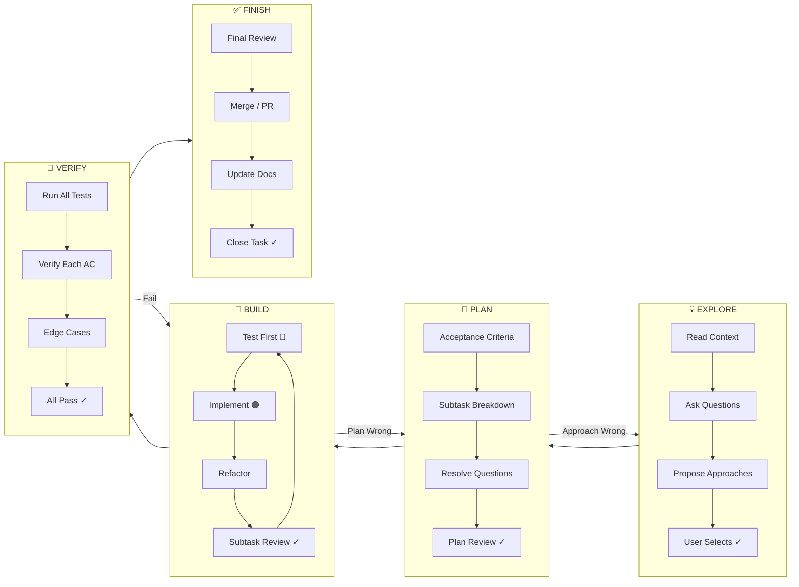
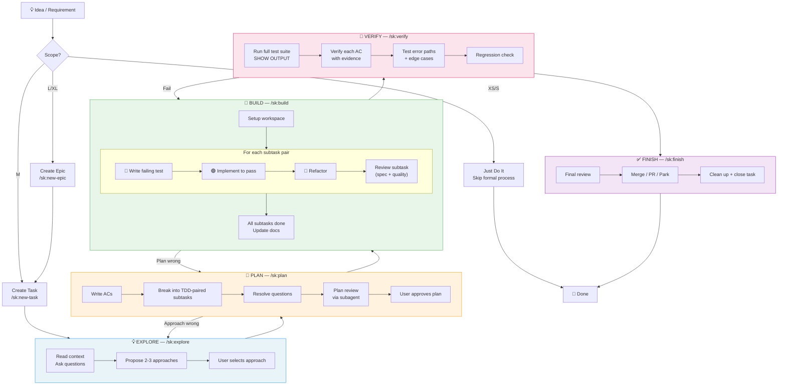
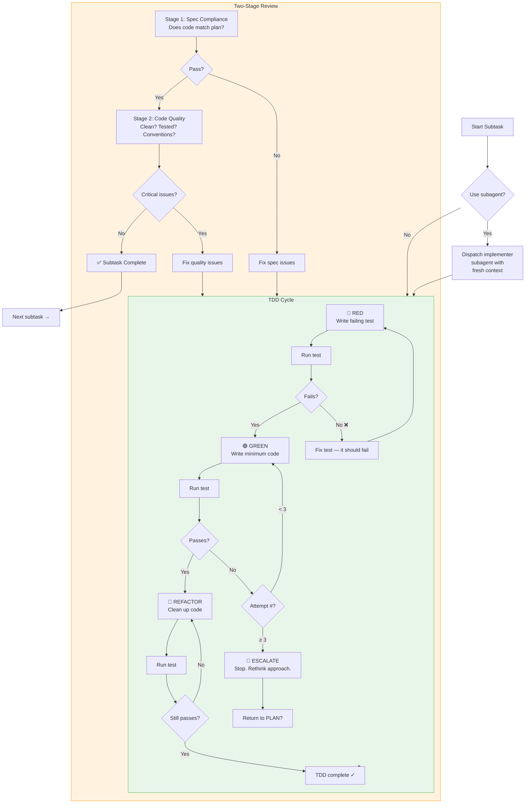
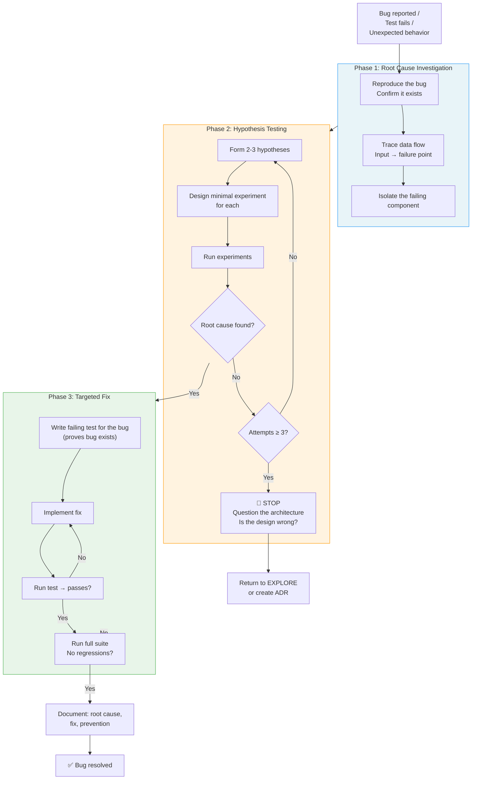

# SK v2: Unified System Design

**Date:** 2026-03-19
**Purpose:** Define how SK's structured documentation + Superpowers' agent discipline combine into one coherent system.

---

## 1. Design Principles

**SK provides the structure.** What work to do, how to track it, where things go.
**Superpowers patterns provide the discipline.** How to do the work rigorously.

The unified system has three layers:

```
┌─────────────────────────────────────────────────┐
│  COMMANDS — Explicit workflows (/sk:*)          │
│  "What to do"                                   │
│  User invokes. Sequential phases with gates.    │
├─────────────────────────────────────────────────┤
│  SKILLS — Behavioral rules (.claude/skills/)    │
│  "How to behave while doing it"                 │
│  Auto-triggered by context. Always-on guards.   │
├─────────────────────────────────────────────────┤
│  AGENTS — Specialized workers (.claude/agents/) │
│  "Who does the work"                            │
│  Dispatched by commands/skills. Fresh context.   │
└─────────────────────────────────────────────────┘
```

**Key rule:** Commands orchestrate. Skills constrain. Agents execute.

---

## 2. The Unified Lifecycle

### Current: `Plan → Dev → Test`
### New: `Explore → Plan → Build → Verify → Finish`

The phases are renamed to reflect expanded scope:

| Old Phase | New Phase | What Changed |
|---|---|---|
| *(none)* | **Explore** | New. Design exploration before committing to a plan. |
| Plan | **Plan** | Enhanced. Approach validation + plan review subagent. |
| Dev | **Build** | Renamed + enhanced. TDD per subtask, subagent dispatch, per-subtask review. |
| *(none in lifecycle)* | *(review is embedded in Build)* | Review happens per-subtask, not as a separate phase. |
| Test | **Verify** | Renamed + enhanced. Fresh evidence required. No claims without proof. |
| *(none)* | **Finish** | New. Branch completion, PR creation, worktree cleanup. |



---

## 3. Phase Details

### 💡 EXPLORE Phase

**Goal:** Validate the *approach* before investing in a detailed plan.

**When to run:** M+ complexity, or when the right approach isn't obvious. Skip for XS/S tasks.

**Command:** `/sk:explore` (new)

**Flow:**

```
1. READ CONTEXT
   ├── docs/architecture/README.md
   ├── docs/system/tech-stack.md
   ├── docs/decisions/README.md (relevant ADRs)
   └── Codebase scan (Grep/Glob for related patterns)

2. ASK CLARIFYING QUESTIONS
   ├── One question at a time
   ├── Multiple choice preferred over open-ended
   └── Maximum 5 questions before proposing

3. PROPOSE APPROACHES
   ├── 2-3 viable approaches
   ├── Each with: description, pros, cons, risk level
   ├── Each with: affected files, estimated subtask count
   └── Recommendation with reasoning

4. USER SELECTS
   └── Record selected approach in task file

5. WRITE DESIGN BRIEF (for L/XL only)
   ├── One-page summary: problem, approach, constraints
   ├── Optionally: dispatch spec-reviewer subagent
   └── Store in task file's "Approach" section

EXIT GATE:
   ├── Approach selected and documented
   ├── Key constraints identified
   ├── User approved
   └── Ready for detailed planning
```

**Skills active:** `brainstorming`

---

### 🎯 PLAN Phase

**Goal:** Know exactly what to build. Every question answered, every subtask defined.

**Command:** `/sk:plan` (enhanced)

**Flow:**

```
1. READ CONTEXT
   ├── Task file (with approach from Explore)
   ├── docs/lifecycle/README.md
   ├── docs/conventions/* (all)
   └── docs/system/* (tech-stack, schema, APIs)

2. WRITE ACCEPTANCE CRITERIA
   ├── 3-5 testable conditions (yes/no verifiable)
   ├── Specific (exact endpoints, responses, behaviors)
   ├── Independent (each verifiable in isolation)
   └── Derived from the selected approach

3. BREAK INTO SUBTASKS
   ├── Each S complexity (single concern, 1-2 files)
   ├── TDD-paired: each feature unit = test subtask + implementation subtask
   │   ├── ST-1 [TEST] Write failing test for feature unit A
   │   ├── ST-2 [DEV]  Implement feature unit A (make test pass)
   │   ├── ST-3 [TEST] Write failing test for feature unit B
   │   ├── ST-4 [DEV]  Implement feature unit B (make test pass)
   │   └── ST-N [DOCS] Update system docs
   ├── Each includes: exact file paths, brief code example
   └── Ordered by dependency (top-to-bottom execution)

4. RESOLVE ALL QUESTIONS
   ├── Research each uncertainty (codebase, docs, conventions)
   ├── Record answers in Open Questions table
   └── No unresolved questions at exit

5. PLAN REVIEW (subagent)
   ├── Dispatch plan-reviewer subagent
   ├── Checks: ACs testable? Subtasks truly S? File paths real? TDD pairs correct?
   ├── Max 2 review iterations
   └── Fix issues found

EXIT GATE:
   ├── Every AC is testable
   ├── Every subtask is S complexity with exact file paths
   ├── Subtasks are TDD-paired (test before implementation)
   ├── No open questions
   ├── Plan reviewed by subagent
   └── User approved
```

**Skills active:** `writing-plans`, `verification-before-completion`

---

### 🔨 BUILD Phase

**Goal:** Implement what was planned using TDD, with review after every subtask.

**Command:** `/sk:build` (replaces `/sk:dev`)

**This is where most skills and agents activate.**

**Flow:**

```
1. VALIDATE READINESS
   ├── Task status is "ready"
   ├── All ACs defined
   ├── All subtasks defined
   └── No blocking questions

2. SET UP WORKSPACE (optional)
   ├── Create git worktree for isolation
   ├── Install dependencies
   └── Run baseline tests (confirm green)

3. FOR EACH SUBTASK PAIR ([TEST] then [DEV]):

   ┌──────────────────────────────────────────────────┐
   │  SUBTASK EXECUTION LOOP                          │
   │                                                  │
   │  3a. DISPATCH IMPLEMENTER (subagent, optional)   │
   │      ├── Fresh context (no accumulated baggage)  │
   │      ├── Receives: subtask spec, file paths,     │
   │      │   conventions, test requirements          │
   │      └── Reports: DONE / DONE_WITH_CONCERNS /    │
   │          NEEDS_CONTEXT / BLOCKED                  │
   │                                                  │
   │  3b. TDD CYCLE (per subtask)                     │
   │      ├── 🔴 RED:   Write failing test            │
   │      │   └── Run test → confirm it FAILS         │
   │      ├── 🟢 GREEN: Write minimum code to pass    │
   │      │   └── Run test → confirm it PASSES        │
   │      ├── 🔄 REFACTOR: Clean up                   │
   │      │   └── Run test → confirm still PASSES     │
   │      └── Show test output as evidence             │
   │                                                  │
   │  3c. SUBTASK REVIEW (two-stage)                  │
   │      ├── Stage 1: SPEC COMPLIANCE                │
   │      │   ├── Dispatch spec-reviewer subagent     │
   │      │   ├── Does code match the plan?           │
   │      │   └── Binary: compliant / issues found    │
   │      ├── Stage 2: CODE QUALITY (only if S1 pass) │
   │      │   ├── Dispatch quality-reviewer subagent  │
   │      │   ├── Clean code? Tests adequate?         │
   │      │   │   Conventions followed?               │
   │      │   └── Critical / Important / Suggestions  │
   │      └── Fix critical issues before proceeding    │
   │                                                  │
   │  3d. CHECK OFF SUBTASK                           │
   │      └── Mark complete in task file              │
   └──────────────────────────────────────────────────┘

4. ESCALATION RULES
   ├── After 3 failed attempts on a subtask:
   │   ├── STOP implementation
   │   ├── Question: Is the subtask too large? → Break down further
   │   ├── Question: Is the plan wrong? → Return to PLAN
   │   └── Question: Is the approach wrong? → Return to EXPLORE
   └── Invoke systematic-debugging skill if root cause unclear

5. DOCUMENTATION PASS
   ├── Execute all [DOCS] subtasks
   ├── Update system docs in same commit as code
   └── Verify cross-references

EXIT GATE:
   ├── All subtasks checked off
   ├── All tests pass (show fresh output)
   ├── All reviews passed (no critical issues)
   ├── Convention compliance verified
   ├── Docs updated
   └── No code written before its test
```

**Skills active:** `test-driven-development`, `subagent-driven-development`, `code-review`, `verification-before-completion`, `systematic-debugging` (if issues arise)

---

### 🧪 VERIFY Phase

**Goal:** Prove every acceptance criterion is met with fresh evidence.

**Command:** `/sk:verify` (replaces `/sk:test`)

**Iron Law: NO COMPLETION CLAIMS WITHOUT FRESH VERIFICATION EVIDENCE.**

**Flow:**

```
1. RUN FULL TEST SUITE
   ├── Execute: npm test && npm run typecheck && npm run lint
   ├── PASTE THE ACTUAL OUTPUT (not a summary)
   └── All must pass before proceeding

2. VERIFY EACH ACCEPTANCE CRITERION
   ├── For each AC:
   │   ├── Run the specific test/command that proves it
   │   ├── Paste the output
   │   ├── Record: "AC-N verified: [exact evidence]"
   │   └── If fails → STOP → return to BUILD
   └── Every AC must have concrete evidence

3. TEST ERROR PATHS
   ├── Invalid input → correct error response?
   ├── Missing auth → 401?
   ├── Not found → 404?
   ├── Run each scenario, show output
   └── Record results in verification table

4. TEST EDGE CASES
   ├── Empty data, null values, boundary values
   ├── Concurrent requests, large payloads
   ├── Run each scenario, show output
   └── Record results in verification table

5. REGRESSION CHECK
   ├── Run full suite again (confirms nothing broke during testing)
   ├── Compare pass count to baseline from step 1
   └── Same or higher count required

EXIT GATE:
   ├── Full test suite passes WITH OUTPUT SHOWN
   ├── Every AC verified with specific evidence
   ├── Error paths tested with evidence
   ├── Edge cases tested with evidence
   ├── No regressions
   └── No TypeScript/lint errors
```

**Skills active:** `verification-before-completion`

---

### ✅ FINISH Phase

**Goal:** Clean completion — merge, PR, or park the work properly.

**Command:** `/sk:finish` (new)

**Flow:**

```
1. FINAL REVIEW
   ├── Dispatch code-reviewer subagent against full diff (base branch → current)
   ├── Review checks: plan alignment, quality, conventions, test coverage
   └── Fix any critical issues

2. PRESENT OPTIONS
   ├── (a) Merge locally to main branch
   ├── (b) Create pull request (via gh pr create)
   ├── (c) Keep branch as-is (continue later)
   └── (d) Discard branch (abandon work)

3. EXECUTE SELECTED OPTION
   ├── If merge: verify tests pass on main after merge
   ├── If PR: include AC summary, test evidence, review results
   ├── If keep: document state for resume later
   └── If discard: confirm with user first

4. CLEAN UP
   ├── Remove worktree (if used)
   ├── Update task status to "done" (or "blocked"/"backlog" if parked)
   ├── Update docs/tasks/README.md
   └── Add final entry to Progress Log

5. CLOSE OUT SUMMARY
   ├── What was built (ACs met)
   ├── Files created/modified
   ├── Docs updated
   ├── Test evidence summary
   └── Follow-up items (if any)
```

**Skills active:** `finishing-a-development-branch`, `verification-before-completion`, `git-worktrees`

---

## 4. Complete Flow Diagrams

### 4.1 End-to-End: Idea to Done



### 4.2 Build Phase Internals (per subtask)



### 4.3 Debugging Flow (when things go wrong)



---

## 5. Command Map (Unified)

### Primary Workflow Commands

| Command | Phase | Purpose | Invokes Skills |
|---|---|---|---|
| `/sk:explore` | Explore | Design exploration, approach selection | brainstorming |
| `/sk:plan` | Plan | ACs, subtask breakdown, plan review | writing-plans, verification |
| `/sk:build` | Build | TDD implementation with subagent review | TDD, SDD, code-review, verification, debugging |
| `/sk:verify` | Verify | Fresh evidence for every AC | verification |
| `/sk:finish` | Finish | Merge/PR/park + cleanup | finishing-branch, git-worktrees |
| `/sk:implement` | All | Full lifecycle in one session | All skills |

### Support Commands

| Command | Purpose | Invokes Skills |
|---|---|---|
| `/sk:debug` | Systematic debugging | systematic-debugging, verification |
| `/sk:review` | On-demand code review | code-review |
| `/sk:new-task` | Create task file | brainstorming (for approach section) |
| `/sk:new-epic` | Create epic file | brainstorming |
| `/sk:task-status` | Show task board | — |
| `/sk:update-docs` | Sync docs with codebase | — |
| `/sk:init-docs` | Bootstrap docs + skills + agents | — |
| `/sk:new-sop` | Create SOP | — |
| `/sk:new-adr` | Create ADR | — |
| `/sk:new-flow` | Create flow diagram | — |

### Command Relationships

```mermaid
flowchart LR
    subgraph CREATION ["Task Creation"]
        NE[/sk:new-epic] --> NT[/sk:new-task]
    end

    subgraph LIFECYCLE ["Development Lifecycle"]
        EX[/sk:explore] --> PL[/sk:plan]
        PL --> BU[/sk:build]
        BU --> VE[/sk:verify]
        VE --> FI[/sk:finish]
    end

    subgraph ONE_SHOT ["One-Shot"]
        IM[/sk:implement<br/>runs all 5 phases]
    end

    subgraph SUPPORT ["On-Demand"]
        DB[/sk:debug]
        RV[/sk:review]
        TS[/sk:task-status]
    end

    NT --> EX
    BU -.->|issues| DB
    BU -.->|on demand| RV
    VE -->|fail| BU

    style LIFECYCLE fill:#e8f5e9,stroke:#4CAF50
    style CREATION fill:#e8f4f8,stroke:#2196F3
    style SUPPORT fill:#fff3e0,stroke:#FF9800
```

---

## 6. Skills Layer

Skills are behavioral rules that run alongside commands. They don't replace commands — they constrain how commands execute.

### Skill Inventory

| Skill | Type | Trigger | Iron Law |
|---|---|---|---|
| `verification-before-completion` | Safety | Any exit gate or completion claim | "No claims without fresh evidence" |
| `test-driven-development` | Safety | Any code writing during Build | "No production code without failing test first" |
| `systematic-debugging` | Process | Test failure, bug report, 3+ failed attempts | "No fixes without root cause investigation" |
| `code-review` | Process | Subtask completion, phase completion | "Two-stage review: spec then quality" |
| `brainstorming` | Process | New task/epic, unclear approach | "Explore before committing" |
| `writing-plans` | Process | Plan creation or revision | "Review plan via subagent before execution" |
| `subagent-driven-development` | Execution | Subtask dispatch during Build | "Fresh context per subtask" |
| `git-worktrees` | Execution | Feature branch work | "Isolated workspace per feature" |

### Skill Priority Rules

```
1. User instructions        — always highest priority, override everything
2. Safety skills             — verification, TDD — CANNOT be skipped
3. Process skills            — debugging, review, brainstorming — skip only if user says so
4. Execution skills          — SDD, worktrees — optional, user can choose
```

### How Skills Compose with Commands

```
Command: /sk:build
├── ALWAYS active:
│   ├── verification-before-completion  (every exit gate)
│   └── test-driven-development         (every subtask)
├── ACTIVE when triggered:
│   ├── systematic-debugging            (if tests fail 3+ times)
│   └── code-review                     (after each subtask)
└── OPTIONAL (user chooses):
    ├── subagent-driven-development     (dispatch fresh agents)
    └── git-worktrees                   (isolated workspace)
```

---

## 7. Agents Layer

Agents are specialized workers dispatched by commands and skills.

### Agent Inventory

| Agent | Dispatched By | Role | Model |
|---|---|---|---|
| **implementer** | `subagent-driven-development` skill | Implements a single subtask with TDD | Sonnet (default) or Haiku (simple tasks) |
| **spec-reviewer** | `code-review` skill | Verifies code matches plan/spec | Haiku |
| **quality-reviewer** | `code-review` skill | Checks code quality, conventions | Sonnet |
| **plan-reviewer** | `writing-plans` skill | Validates plan quality before execution | Haiku |
| **code-reviewer** | `/sk:review`, `/sk:finish` | Full code review against diff | Sonnet |
| **spec-document-reviewer** | `brainstorming` skill | Validates design spec | Haiku |

### Agent Communication Protocol

Every agent reports one of four statuses:

```
DONE               → Subtask complete, all checks pass
DONE_WITH_CONCERNS → Complete but flagging potential issues
NEEDS_CONTEXT      → Missing information, needs orchestrator input
BLOCKED            → Cannot proceed, requires human decision
```

### When to Use Subagents vs Direct Execution

```
Use subagent when:
├── Subtask is well-defined (clear inputs/outputs)
├── Context is getting large (prevent pollution)
├── Task is independent (no cross-subtask state)
└── You want cost optimization (cheaper model for simple work)

Use direct execution when:
├── Task requires conversation with user
├── Task depends on accumulated context
├── Task is XS complexity (subagent overhead not worth it)
└── User prefers to see work happening in real-time
```

---

## 8. Task File Evolution

The task file grows through each phase:

```markdown
# TASK-feature-name

## Meta
- Status: done
- Priority: P1
- Complexity: M
- Created: 2026-03-19

## 💡 EXPLORE (filled by /sk:explore)
### Approach Options
| Option | Pros | Cons | Risk |
|--------|------|------|------|
| A: ... | ... | ... | Low |
| B: ... | ... | ... | Medium |

### Selected Approach: Option A
Reason: ...

## 🎯 PLAN (filled by /sk:plan)
### Acceptance Criteria
- [ ] AC-1: ...
- [ ] AC-2: ...

### Subtasks
- [ ] ST-1 [TEST] Write failing test for ... (`tests/feature.test.ts`)
- [ ] ST-2 [DEV]  Implement ... (`src/services/feature.ts`)
- [ ] ST-3 [TEST] Write failing test for ... (`tests/api.test.ts`)
- [ ] ST-4 [DEV]  Create API endpoint (`src/app/api/feature/route.ts`)
- [ ] ST-5 [DOCS] Update system docs

### Plan Review
- Reviewed by: plan-reviewer subagent
- Issues found: 0
- Iterations: 1

## 🔨 BUILD (filled by /sk:build)
### Implementation Notes
- ST-1/ST-2: Used existing pattern from `src/services/auth.ts`
- ST-3/ST-4: Zod schema shared with service layer

### Review Results
| Subtask | Spec Review | Quality Review | Issues Fixed |
|---------|-------------|----------------|--------------|
| ST-1/2 | ✅ Pass | ✅ Pass | 0 |
| ST-3/4 | ✅ Pass | ⚠️ 1 suggestion | Renamed variable |

## 🧪 VERIFY (filled by /sk:verify)
### Test Output
```bash
npm test — 42 passed, 0 failed
npm run typecheck — no errors
npm run lint — no warnings
```

### AC Verification
- [x] AC-1 verified: POST /api/feature returns 201 with {id, name}
- [x] AC-2 verified: Invalid input returns 400 with field errors

### Error Path Results
| Scenario | Expected | Actual | Pass |
|----------|----------|--------|------|
| No auth | 401 | 401 | ✅ |
| Bad input | 400 | 400 | ✅ |

## ✅ FINISH
- Merged via: PR #47
- Branch: feature/task-name
- Final review: 0 critical, 1 suggestion (deferred)

## Progress Log
| Date | Phase | Note |
|------|-------|------|
| 2026-03-19 | EXPLORE | 3 approaches proposed, Option A selected |
| 2026-03-19 | PLAN | 5 subtasks, plan reviewed |
| 2026-03-19 | BUILD | All subtasks complete, 2 review cycles |
| 2026-03-19 | VERIFY | All ACs verified with evidence |
| 2026-03-19 | FINISH | Merged via PR #47 |
```

---

## 9. Interaction Patterns

### Pattern 1: Normal Feature Development (M complexity)

```
User: "Add PDF export for reports"

  /sk:new-task   → Creates TASK-add-pdf-export.md
  /sk:explore    → Proposes: (A) puppeteer, (B) react-pdf, (C) server-side html-to-pdf
                   User selects B
  /sk:plan       → 6 TDD-paired subtasks, 3 ACs, plan reviewed by subagent
                   User approves
  /sk:build      → Executes subtasks with TDD
                   Each subtask: test → implement → review
                   All pass
  /sk:verify     → Runs tests (shows output), verifies each AC with evidence
                   All pass
  /sk:finish     → Creates PR, updates task board

  — or —

  /sk:implement  → Runs all 5 phases automatically, pausing for user approval at gates
```

### Pattern 2: Large Feature (L/XL complexity)

```
User: "Build user authentication system"

  /sk:new-epic   → Creates EPIC-user-auth.md
                   Decomposes into 4 tasks:
                   T1: User registration, T2: Login/logout,
                   T3: Password reset, T4: Session management

  For each task:
    /sk:explore  → Validate approach for this task
    /sk:plan     → Break into TDD-paired subtasks
    /sk:build    → Implement with subagent dispatch
    /sk:verify   → Verify with evidence
    /sk:finish   → Merge task branch

  After all tasks: Update epic status to done
```

### Pattern 3: Bug Fix

```
User: "Users are getting 500 errors on the dashboard"

  /sk:debug      → 4-phase investigation
                   Phase 1: Reproduce → confirmed, trace data flow
                   Phase 2: Hypothesize → (A) null user, (B) missing join, (C) timeout
                   Phase 3: Test → Hypothesis B confirmed (missing join on new table)
                   Phase 4: Fix with TDD
                     Write test that reproduces the bug
                     Implement fix (add join)
                     Verify test passes + no regressions
                   Document root cause in task file or ADR
```

### Pattern 4: Quick Fix (XS/S complexity)

```
User: "Rename the 'email' field to 'emailAddress' in the user API response"

  No formal process needed. Just do it:
  1. Find all references (Grep)
  2. Write/update test
  3. Make the change
  4. Run tests → show output
  5. Update API docs
```

### Pattern 5: Resume After Context Reset

```
User: "Continue working on TASK-add-pdf-export"

  1. Read task file → see current state
  2. Check which subtasks are done / remaining
  3. Resume from next unchecked subtask
  4. Continue with BUILD flow
```

---

## 10. File System Layout

```
project/
├── CLAUDE.md                          # Agent instructions (reads on startup)
├── docs/
│   ├── README.md                      # Master documentation index
│   ├── lifecycle/
│   │   └── README.md                  # Explore → Plan → Build → Verify → Finish
│   ├── architecture/                  # System design
│   ├── conventions/                   # Code standards
│   ├── decisions/                     # ADRs
│   ├── flows/                         # Mermaid diagrams
│   ├── sop/                           # Procedures
│   ├── system/                        # Tech stack, schema, APIs
│   ├── tasks/                         # Task board + task files
│   └── templates/                     # Document templates
├── .claude/
│   ├── commands/sk/                   # Slash commands (16 total)
│   │   ├── explore.md                 # NEW — design exploration
│   │   ├── plan.md                    # ENHANCED — approach validation + plan review
│   │   ├── build.md                   # REPLACES dev.md — TDD + subagent + review
│   │   ├── verify.md                  # REPLACES test.md — evidence required
│   │   ├── finish.md                  # NEW — branch completion
│   │   ├── implement.md               # ENHANCED — runs all 5 phases
│   │   ├── debug.md                   # NEW — systematic debugging
│   │   ├── review.md                  # NEW — on-demand code review
│   │   ├── new-task.md                # ENHANCED — TDD-paired subtasks
│   │   ├── new-epic.md                # ENHANCED — brainstorm + risk register
│   │   ├── task-status.md             # UNCHANGED
│   │   ├── update-docs.md             # ENHANCED — skills inventory
│   │   ├── init-docs.md               # ENHANCED — bootstrap skills/agents
│   │   ├── new-sop.md                 # UNCHANGED
│   │   ├── new-adr.md                 # UNCHANGED
│   │   └── new-flow.md                # UNCHANGED
│   ├── skills/                        # Behavioral rules (8 skills)
│   │   ├── using-skills/
│   │   │   └── SKILL.md               # Meta-skill: how to find and invoke skills
│   │   ├── verification-before-completion/
│   │   │   └── SKILL.md               # No claims without evidence
│   │   ├── test-driven-development/
│   │   │   ├── SKILL.md               # RED-GREEN-REFACTOR enforcement
│   │   │   └── anti-patterns.md       # What never to do
│   │   ├── systematic-debugging/
│   │   │   ├── SKILL.md               # 4-phase process
│   │   │   ├── root-cause-tracing.md  # Investigation techniques
│   │   │   └── escalation-rules.md    # When to step back
│   │   ├── code-review/
│   │   │   ├── SKILL.md               # When/how to review
│   │   │   ├── reviewer-prompt.md     # Review criteria
│   │   │   └── response-rules.md      # How to handle feedback
│   │   ├── brainstorming/
│   │   │   ├── SKILL.md               # Structured design exploration
│   │   │   └── spec-reviewer-prompt.md
│   │   ├── subagent-driven-development/
│   │   │   ├── SKILL.md               # Orchestration rules
│   │   │   ├── implementer-prompt.md  # Task implementer template
│   │   │   ├── spec-reviewer-prompt.md
│   │   │   └── quality-reviewer-prompt.md
│   │   └── git-worktrees/
│   │       └── SKILL.md               # Isolated workspace management
│   └── agents/                        # Specialized workers (1 agent)
│       └── code-reviewer.md           # Full code review agent
└── hooks/
    └── session-start.sh               # Display task status on startup
```

---

## 11. Migration Path

### Phase 1: Safety Skills (do first, immediate impact)

1. Create `.claude/skills/verification-before-completion/SKILL.md`
2. Create `.claude/skills/test-driven-development/SKILL.md`
3. Update `CLAUDE.md` to reference skills
4. Update `/sk:dev` → inject TDD and verification rules (no rename yet)
5. Update `/sk:test` → inject evidence requirement (no rename yet)

**Result:** Existing commands become more disciplined. No breaking changes.

### Phase 2: New Commands + Process Skills

1. Create `/sk:explore` command + `brainstorming` skill
2. Create `/sk:debug` command + `systematic-debugging` skill
3. Create `/sk:review` command + `code-review` skill + `code-reviewer` agent
4. Create `/sk:finish` command
5. Update `docs/lifecycle/README.md` with new flow

**Result:** New capabilities available. Old commands still work.

### Phase 3: Command Evolution

1. Rename `/sk:dev` → `/sk:build` (keep `dev.md` as redirect)
2. Rename `/sk:test` → `/sk:verify` (keep `test.md` as redirect)
3. Enhance `/sk:plan` with approach validation + plan review
4. Enhance `/sk:implement` to use all 5 phases
5. Enhance `/sk:new-task` with TDD-paired subtask ordering

**Result:** Full unified system. Old command names still work via redirects.

### Phase 4: Subagent Orchestration

1. Create `subagent-driven-development` skill with prompt templates
2. Integrate into `/sk:build` as optional mode
3. Add model selection strategy
4. Create `git-worktrees` skill

**Result:** Full autonomous development capability.

---

## 12. Summary

The unified system combines SK's structural strengths with Superpowers' behavioral discipline:

```
SK v1 (current):           SK v2 (unified):
─────────────────          ────────────────────────────────
Plan → Dev → Test          Explore → Plan → Build → Verify → Finish
12 commands                16 commands + 8 skills + 1 agent
Exit gates                 Exit gates + iron laws + fresh evidence
Self-review                Two-stage subagent review
Code then test             Test then code (TDD enforced)
No debugging process       4-phase systematic debugging
No design validation       Structured brainstorming
No branch completion       Clean finish with PR/merge options
```

The migration is incremental — each phase adds value without breaking existing workflows.
