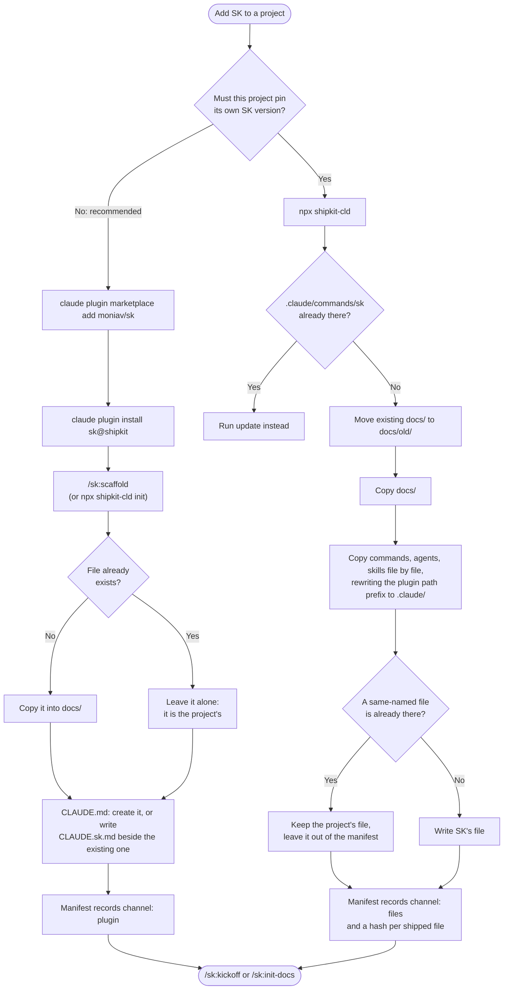

# Flow: Install channels

**Last updated:** 2026-10-04
**Lifecycle:** archived  <!-- SK 2.x: the file-copy channel was removed in 3.0 -->
**Source:** `pkg/cli.mjs`, `.claude-plugin/marketplace.json`, `pkg/.claude-plugin/plugin.json`
**Type:** Flowchart
**Format:** Mermaid

## Overview

SK reaches a project through one of two channels.
The plugin keeps commands, skills and agents outside the project; the file-copy channel puts them in the project's `.claude/`.
Both leave the project owning `docs/` and `CLAUDE.md`.

## Diagram

## Step-by-Step Explanation

1. **Choose a channel.** The plugin is the default. Copying files is for a project that must stay on a specific SK version, because a plugin is one version per user.
2. **Plugin: install once per machine.** The marketplace entry installs the plugin from `./pkg`, so the plugin cache holds only what ships. The plugin's `version` equals `package.json`.
3. **Plugin: `/sk:scaffold` once per project.** The command runs `init` from the CLI that ships inside the plugin, so the scaffold matches the plugin's version; `npx shipkit-cld init` runs the same code from npm. It copies only the files the project does not have yet, so it is safe on a project with existing docs and safe to run again. It refuses to run if SK is already copied into the project.
4. **File copy: one command.** Existing `docs/` content is moved to `docs/old/<timestamp>/` first. Commands, agents and skills are written one file at a time; a file the project already has under the same name is treated as the project's own.
5. **Path rewrite.** Shipped commands refer to shared skills as `${CLAUDE_PLUGIN_ROOT}/.claude/...`. The plugin resolves that variable; the file-copy channel rewrites the prefix to `.claude/` as it writes each file.
6. **Manifest.** `.claude/.sk-manifest.json` records the version, the channel, the profile, who owns `CLAUDE.md`, and a hash for every file SK wrote.

## Error Paths

- **`init` on a file-copy install:** exits with the three steps to migrate (`remove`, install the plugin, `init`).
- **Both channels installed:** every command appears twice. Remove the copied files with `npx shipkit-cld remove .`.
- **No source found:** the CLI prints how to run it from npm or a local checkout.

## Related Docs

- [Safe update flow](./safe-update.md)
- [Architecture](../architecture/README.md)
- [Install as a plugin](../user-guides/install-as-plugin.md)
- [ADR-002: plugin distribution](../decisions/ADR-002-plugin-distribution.md)
