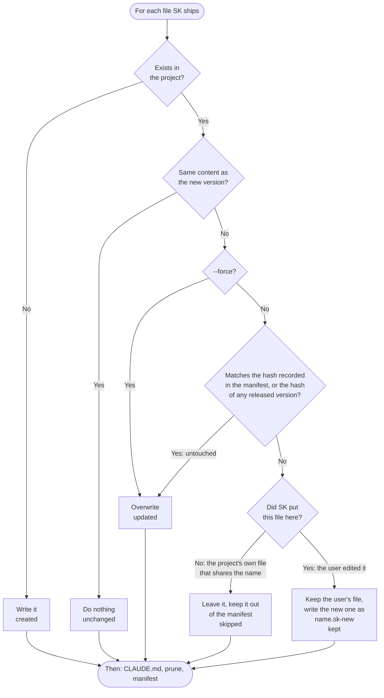

# Flow: Safe update

**Last updated:** 2026-10-04
**Lifecycle:** archived  <!-- SK 2.x: the file-copy channel was removed in 3.0 -->
**Source:** `pkg/cli.mjs` (`syncFile`, `pruneRemoved`, `syncClaudeMd`), `scripts/baselines.mjs`
**Type:** Flowchart
**Format:** Mermaid

## Overview

`npx shipkit-cld update` brings SK's managed files up to date one file at a time.
The rule it follows: never overwrite something the user changed, and never overwrite something that was the user's to begin with.

## Diagram

## Step-by-Step Explanation

1. **Compare content first.** Hashes are taken with line endings normalised, so a checkout that converts line endings does not look like an edit.
2. **Is the file untouched?** A file is untouched when its hash equals the one the manifest recorded at the last install or update. For an install made before the manifest recorded hashes, `pkg/.sk-baselines.json` supplies the hash of every released version of that file instead.
3. **Untouched files are overwritten.** That is the normal case.
4. **Edited files are kept.** The new version is written beside the file as `<name>.sk-new`. The user merges and deletes the sidecar, or renames the sidecar over the file to take SK's version. Once the file matches SK's version, the next update removes any leftover sidecar.
5. **The project's own files are skipped.** A file that exists under a shipped name but that SK never wrote is the project's. It stays out of the manifest, so later updates and `remove` leave it alone too.
6. **`CLAUDE.md`.** If SK created it and it is untouched, it is refreshed. If the user edited it, or it was theirs from the start, the new template goes to `CLAUDE.sk.md`.
7. **Prune.** A file SK shipped before and no longer ships is deleted only if it is untouched; an edited one is left and reported.
8. **Write the manifest** with the new version and the hash of each managed file.

`--dry-run` walks the same decisions and writes nothing. `--yes` skips the confirmation prompt.

## Error Paths

- **SK is not installed in the target:** the CLI says so and exits. A plugin-channel project (set up with `init`) is recognised by its manifest and gets only its shipped docs refreshed.
- **Many sidecars on the first update after this change:** an install with no recorded hashes whose files match no released version is treated as edited. The output explains this and names `--force`.

## Related Docs

- [Install channels flow](./install-channels.md)
- [Architecture](../architecture/README.md)
