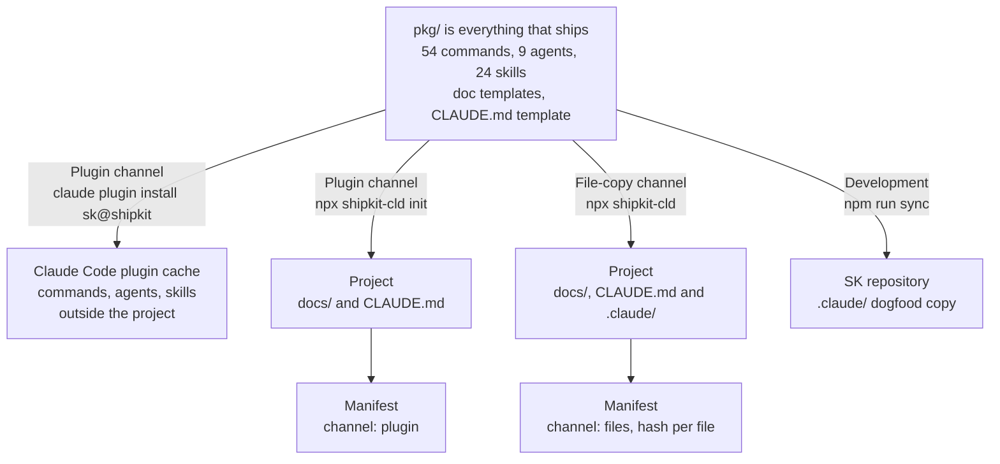

# Architecture

> System design and component relationships for SK.

**Last updated:** 2026-10-04
**Lifecycle:** current
**Source:** `cli.mjs`, `pkg/`, `.claude-plugin/`, `scripts/`

## Overview

SK is a set of prompt files (commands, skills, agents), a documentation tree, and a small CLI that puts them in place.
There is no runtime server, database or API.
The same `pkg/` directory is delivered two ways: as a Claude Code plugin, or as files copied into a project.

## CLI Commands

| Command | Function |
|---------|----------|
| `npx shipkit-cld init [target] [--minimal]` | Scaffold `docs/` and `CLAUDE.md` only, for use with the plugin. Fills gaps, never replaces a file |
| `npx shipkit-cld [target] [--minimal]` | File-copy install: docs plus commands, agents and skills in `.claude/` |
| `npx shipkit-cld update [target]` | Refresh SK-managed files one at a time, keeping user edits. Flags: `--dry-run`, `--yes`, `--force`, `--from <path>` |
| `npx shipkit-cld remove [target]` | Remove SK's files and sidecars, keep `docs/` and the user's own files |

## Component Index

| Component | Location | Purpose |
|-----------|----------|---------|
| CLI | `cli.mjs` | Install, update, remove, init. Zero dependencies |
| Payload and plugin root | `pkg/` | Everything that ships |
| Plugin manifest | `pkg/.claude-plugin/plugin.json` | Name `sk`, version (equals `package.json`), component paths |
| Marketplace | `.claude-plugin/marketplace.json` | Marketplace `shipkit`, installs `sk` from `./pkg` |
| Commands | `pkg/.claude/commands/sk/` | 54 slash commands; six are model-invocable |
| Agents | `pkg/.claude/agents/` | implementer, spec-reviewer, plan-reviewer, quality-reviewer, security-reviewer, perf-reviewer, architecture-reviewer, dependency-analyzer, debugger |
| Skills | `pkg/.claude/skills/` | 24 skills: 11 model-invoked, 13 user-invoked or loaded by commands |
| Doc templates | `pkg/docs/templates/` | 26 templates |
| Conventions | `pkg/docs/conventions/` | Code style, coding behaviour, file structure, git workflow, testing, doc lifecycle, delegation policy |
| Release baselines | `pkg/.sk-baselines.json` | Generated: the hash of every released version of each managed file |
| Check script | `scripts/check.mjs` | `npm test`: sync, counts, frontmatter, permissions, paths, models, install and update regressions |
| Evals | `dev-docs/evals/`, `scripts/evals.mjs` | Trigger cases run on `claude plugin eval` |

## How the pieces load

- **A command** is loaded by Claude Code when the user types it (or, for six of them, when the model chooses it). Claude Code substitutes `${CLAUDE_PLUGIN_ROOT}` in its body.
- **A shared skill** such as `git-commit-flow` is read by a command with the Read tool. Nothing is substituted in a file read that way, so it refers to sibling skills by relative path.
- **A model-invoked skill** is listed to the model by its description and loaded when the model calls the Skill tool.
- **An agent** is dispatched by type (`implementer`, or `sk:implementer` under the plugin). Its frontmatter sets its tools, its model and any skills preloaded into it.
- **Three behaviour rules** (evidence before done, stop after three failed attempts, what "just do it" permits) are always on through the project's `CLAUDE.md`.

## Key Design Principles

1. **Zero dependencies.** The CLI uses only the Node.js standard library.
2. **One source, two channels.** `pkg/` is both the plugin root and what the CLI copies; a path rewrite on copy is the only difference.
3. **Updates never destroy user work.** A per-file hash decides between overwrite, keep with a sidecar, and skip. See [Safe update](../flows/safe-update.md).
4. **Context is a budget.** Only six commands and eleven skills put a description in every turn. Everything else is user-invoked.
5. **Language agnostic.** Commands never assume a language or framework.
6. **Proof over claims.** Gates end on something that can be shown: command output, a file, a count.
7. **Dogfooding.** Root `.claude/` is generated from `pkg/.claude/` so SK is developed with SK.

## Related

- [Install channels flow](../flows/install-channels.md)
- [Safe update flow](../flows/safe-update.md)
- [ADR-002: plugin distribution](../decisions/ADR-002-plugin-distribution.md)

The earlier SVG architecture diagram (v1.6, 29 commands) is in [`_archive/`](../_archive/README.md).
