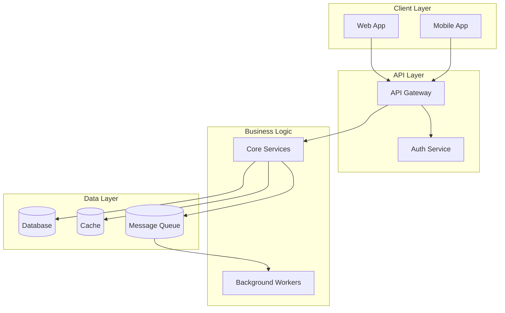

# Architecture

> System design, component relationships, and data flow patterns.

**Last updated:** YYYY-MM-DD

## Overview

<!-- High-level description of the system architecture -->

> ⚠️ Replace the diagram above with your actual system architecture.

## Component Index

| Component | Doc | Owner | Status |
|-----------|-----|-------|--------|
| <!-- e.g. Auth Service --> | [Link](./auth-service.md) | — | Active |

## Key Design Principles

<!-- List 3-5 architectural principles that guide decisions -->

1. **Principle:** Description
2. **Principle:** Description

## Cross-Cutting Concerns

- **Authentication:** How auth works across services
- **Error Handling:** Standard error patterns
- **Logging:** Structured logging approach
- **Monitoring:** Observability strategy
