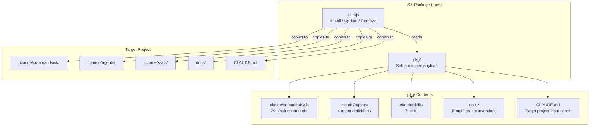

# Architecture

> System design and component relationships for SK.

**Last updated:** 2026-03-23

## Overview

SK is a file-based CLI tool. It copies structured documentation, slash commands, agents, and skills into target projects. There is no runtime server, database, or API.

## CLI Commands

| Command | Function |
|---------|----------|
| `npx shipkit-cld [target]` | Install SK into target directory |
| `npx shipkit-cld update [target]` | Update commands, templates, SOPs (preserves user content) |
| `npx shipkit-cld remove [target]` | Remove SK system files (preserves `docs/`) |

## Component Index

| Component | File | Purpose |
|-----------|------|---------|
| CLI | `cli.mjs` | Entry point — install, update, remove logic |
| Package payload | `pkg/` | Everything that gets installed |
| Slash commands | `pkg/.claude/commands/sk/` | 29 lifecycle commands |
| Agents | `pkg/.claude/agents/` | Implementer, spec-reviewer, quality-reviewer, dependency-analyzer |
| Skills | `pkg/.claude/skills/` | TDD, escalation, legal-advisor, subagent-dev, verification, git-worktrees, technical-diagrams |
| Doc templates | `pkg/docs/templates/` | Starter templates for all doc types |
| Conventions | `pkg/docs/conventions/` | Code style, file structure, git workflow, testing, coding behavior |

## Key Design Principles

1. **Zero dependencies:** CLI uses only Node.js stdlib — no install step, no supply chain risk
2. **Self-contained package:** `pkg/` contains everything needed — no external references
3. **Non-destructive updates:** `update` overwrites commands/templates but preserves user-authored docs
4. **Language agnostic:** Commands never assume a specific language or framework
5. **Dogfooding:** Root `.claude/` mirrors `pkg/.claude/` so SK development uses SK itself

## Visual Diagram

See [sk-architecture.svg](./sk-architecture.svg) for a visual representation of the architecture above.
