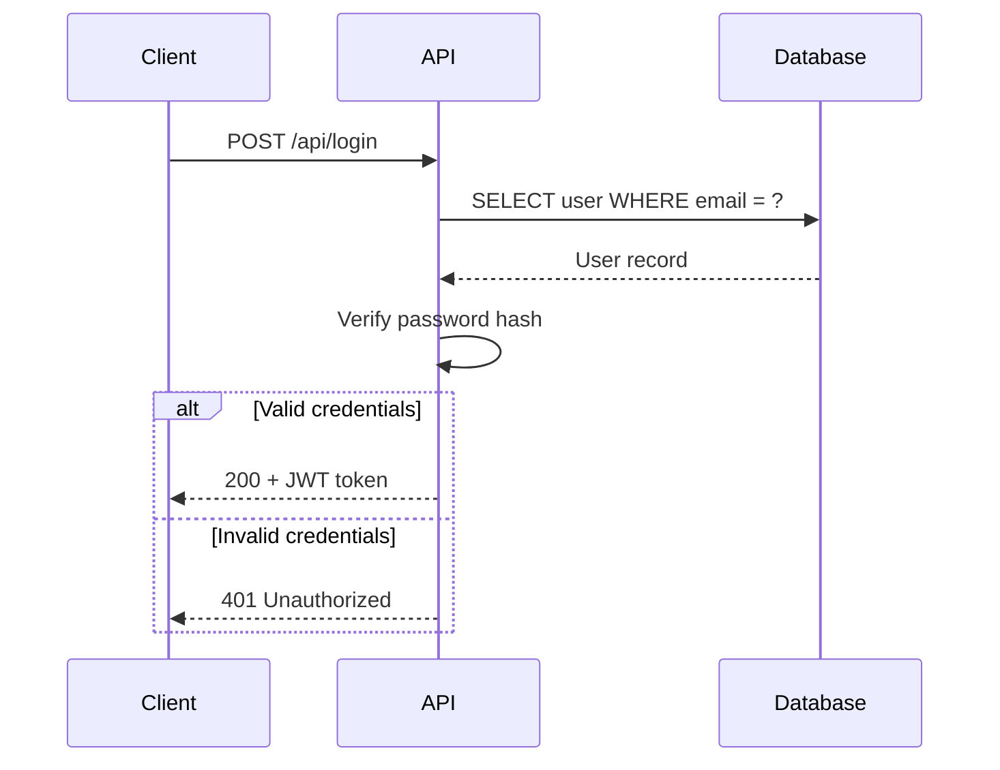
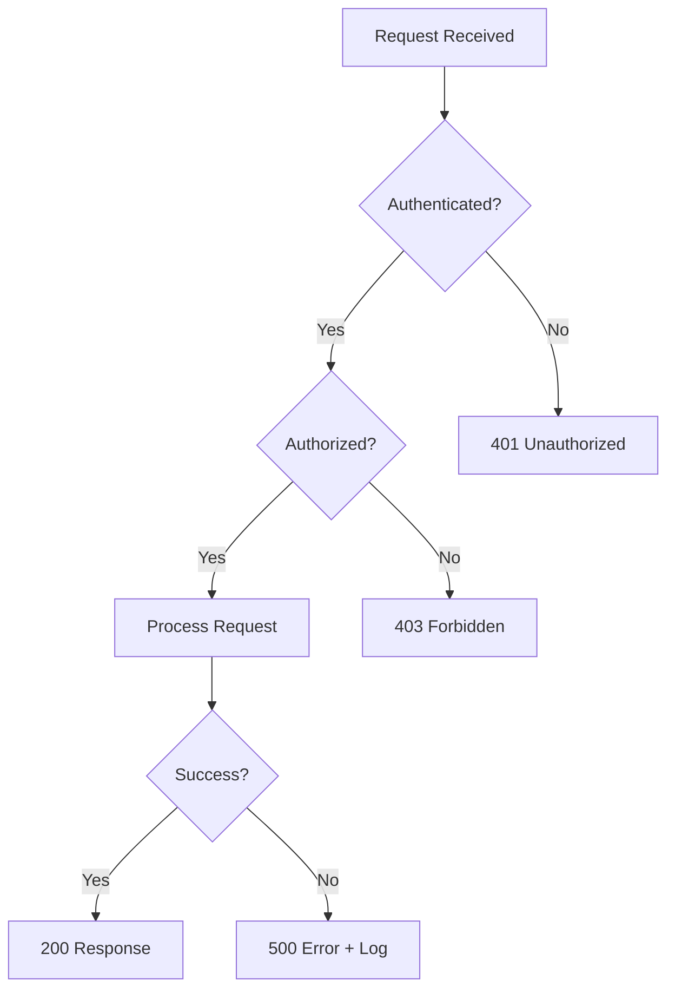
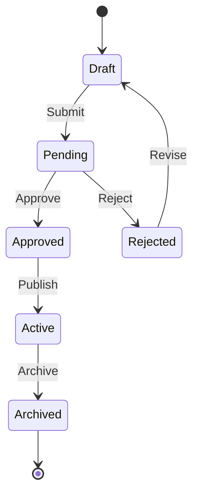
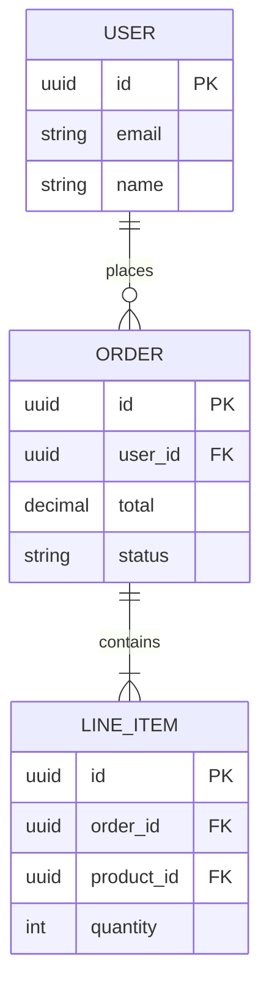

# Flow Diagrams

> Visual diagrams for key system processes using Mermaid syntax.
> These render natively in GitHub, VS Code, and most markdown viewers.

**Last updated:** YYYY-MM-DD

## Diagram Index

<!-- Add your flow diagrams here as you create them with /sk:new-flow -->

| Flow | Type | Description |
|------|------|-------------|
| — | — | No flows created yet |

## Suggested Flows

Create these as your project develops, using the [flow template](../templates/flow-diagram.md):

| Flow | Type | Description |
|------|------|-------------|
| User Authentication | Sequence | Login, signup, token refresh |
| Request Lifecycle | Flowchart | From HTTP request to response |
| Data Pipeline | Flowchart | How data moves through the system |
| Deployment | Flowchart | CI/CD pipeline stages |
| Error Handling | Flowchart | How errors propagate and get handled |

## Mermaid Cheat Sheet

### Sequence Diagram (for interactions between components)

### Flowchart (for processes and decisions)

### State Diagram (for entity lifecycles)

### Entity Relationship (for data models)

> Create new flow diagrams using the [flow template](../templates/flow-diagram.md)
