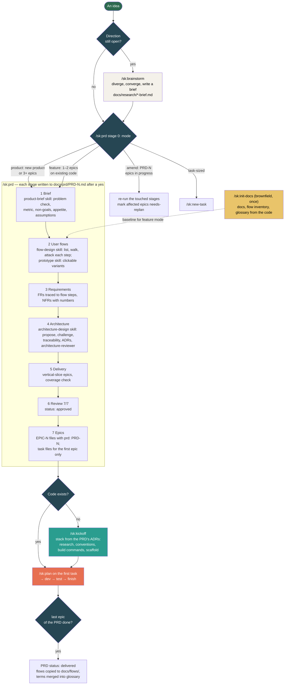

# Flow: Idea to epics

**Last updated:** 2026-10-05
**Lifecycle:** current
**Source:** `pkg/.claude/commands/sk/prd.md`, `brainstorm.md`, `kickoff.md`, `init-docs.md`, `finish.md`; skills `product-brief`, `flow-design`, `architecture-design`, `prototype`
**Type:** Flowchart
**Format:** Mermaid

## Overview

How an idea becomes epics that `/sk:plan` can work on, and which command owns each step.
`/sk:prd` is the spine: it grills the idea in stages, writes each stage to the PRD file once the user confirms it, and cuts the approved PRD into epics.
Everything before it decides *whether* and *what*; everything after it decides *how*.

**Persona:** founder or product owner working with Claude Code · **Trigger:** an idea, or a feature request on an existing product · **Preconditions:** SK installed, `docs/` scaffolded · **End state:** epics in `docs/tasks/` with task files for the first one, and `.current` pointing at it

## Diagram

## Steps

| # | User does | System does |
|---|-----------|-------------|
| 1 | Types `/sk:prd <idea>` (or `/sk:brainstorm` first when the direction is open) | Reads project docs, the glossary, existing flows and PRDs; picks the mode and says which; creates `docs/prd/PRD-N-<slug>.md` from the template |
| 2 | Answers numbered questions, each with a recommended answer | Challenges vague words and solutions-before-problems; looks up facts itself; settles glossary terms as they come up |
| 3 | Says yes at each gate | Writes that stage to the PRD, marks it settled, sets `stage:` to the next one, logs the decision |
| 4 | Picks a prototype variant where offered | Builds 3–5 clickable variants of the flow in one HTML file with a worst-case data toggle; records the choice as requirements |
| 5 | Confirms the epic table | Checks every Must requirement is in exactly one epic; writes the epic files and the first epic's tasks; points `.current` at it |
| 6 | Continues with `/sk:kickoff` (greenfield) or `/sk:plan` | Kickoff reads the stack from the PRD's ADRs; plan reads the task's `delivers:` FR ids |

## Error Paths

| Case | At step | Behaviour | Requirement |
|------|---------|-----------|-------------|
| Session ends mid-PRD | any | The PRD file holds the state; `/sk:prd PRD-N` resumes at `stage:` | prd Rules |
| Idea overlaps an existing PRD | 1 | Raised as a conflict, not duplicated | prd Stage 0 |
| Request is one task | 1 | Redirected to `/sk:new-task` | prd Stage 0 |
| Requirement changes after approval | 6 | `/sk:prd PRD-N amend`: touched stages re-run, affected epics and tasks marked `needs-replan`, `version:` bumped | prd Stage 0 |
| A Must FR depends on an open question | 6 | Review fails (`PRD review: N/7`) until resolved | prd Stage 6 |
| More than 9 tasks in one epic | 5 | Split the epic | prd Stage 5 |
| No `docs/` scaffold | 1 | `/sk:prd` runs the scaffold itself | prd Stage 0 |

## Related Docs

- [Command reference](../commands-reference.md)
- [PRD template](../templates/prd.md), [epic template](../templates/epic.md)
- [Architecture: how the pieces load](../architecture/README.md)
- Planning note: `dev-docs/planning/2026-10-idea-and-planning-enhancement-plan.md`
