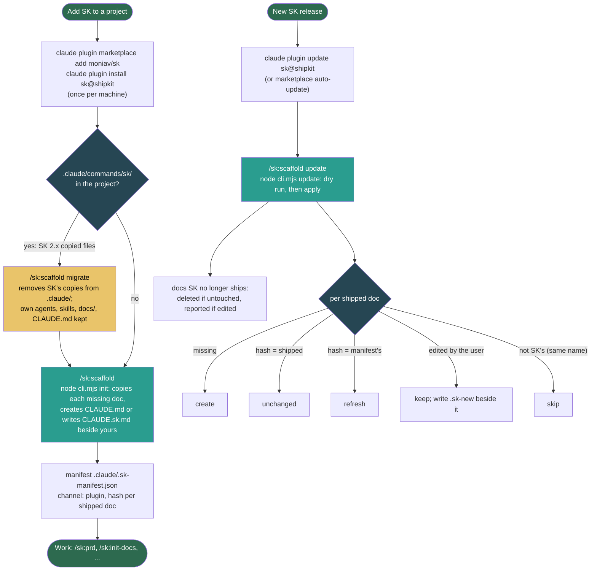

# Flow: Install and update

**Last updated:** 2026-10-05
**Lifecycle:** current
**Source:** `pkg/cli.mjs`, `pkg/.claude/commands/sk/scaffold.md`, `.claude-plugin/marketplace.json`, `pkg/.claude-plugin/plugin.json`
**Type:** Flowchart
**Format:** Mermaid

## Overview

SK reaches a project through the Claude Code plugin only. The plugin cache holds the commands, agents and skills; the project holds `docs/` and `CLAUDE.md`, created and refreshed by the script that ships inside the plugin.

**Persona:** developer adding SK to a project · **Trigger:** first use, a new SK release, or a project left over from SK 2.x · **End state:** the plugin installed, `docs/` scaffolded, the manifest recording `channel: plugin`

## Diagram

## Steps

| # | User does | System does |
|---|-----------|-------------|
| 1 | Adds the marketplace and installs the plugin | Claude Code caches `pkg/`; `/sk:` commands, `sk:` agents and the skills load in every project |
| 2 | Runs `/sk:scaffold` in a project | The command runs `node "${CLAUDE_PLUGIN_ROOT}/cli.mjs" init .`: every missing doc is copied, existing files are left alone, the manifest is written |
| 3 | After a plugin update, runs `/sk:scaffold update` | Dry run, then per-doc decision as in the diagram; `CLAUDE.md` is refreshed only while SK created it and it is unedited |
| 4 | On an SK 2.x project, runs `/sk:scaffold migrate` | SK's copied commands, agents and skills are removed (by the manifest's record when there is one), `.sk-source` and sidecars go, the manifest switches to `channel: plugin`, docs hashes are kept |

## Error Paths

| Case | At step | Behaviour | Requirement |
|------|---------|-----------|-------------|
| `.claude/commands/sk/` exists and the user runs `init` or `update` | 2, 3 | The script refuses and names `/sk:scaffold migrate` | cli.mjs `explainMigrate` |
| Node.js missing or older than 18 | 2 | `/sk:scaffold` stops before running the script | scaffold Step 1 |
| The project already has `CLAUDE.md` | 2 | Kept; SK's template written as `CLAUDE.sk.md` to merge by hand | cli.mjs `init` |
| A shipped doc was edited | 3 | Kept; new version beside it as `.sk-new`; `--force` takes SK's version | cli.mjs `syncFile` |
| A user's own doc shares a shipped name | 2, 3 | Never written, never recorded as SK's | manifest `mine` |
| Migrating with no manifest (very old install) | 4 | Whole `.claude/agents` and `.claude/skills` are removed after a confirmation that says so | cli.mjs `migrate` |
| Agents in Claude web or desktop chat | any | Plugin agents do not load there; commands that dispatch them need the CLI or Cowork | platform support |

## Related Docs

- [Architecture](../architecture/README.md)
- [Install guide](../user-guides/install-as-plugin.md)
- Archived: the SK 2.x [install channels](../_archive/2026-install-channels.md) and [safe update](../_archive/2026-safe-update.md) flows
