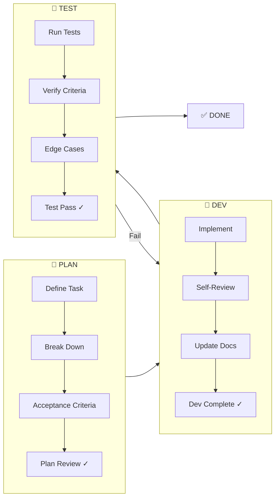
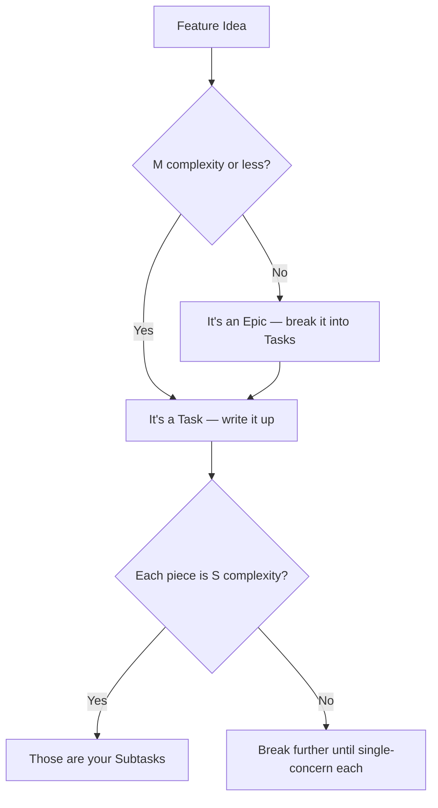

# Development Lifecycle

> Every piece of work follows the same cycle: **Plan → Dev → Test → Done.**
> No phase is skipped. Each phase has a clear entry/exit gate.

**Last updated:** YYYY-MM-DD

## The Cycle



## Phase Details

### 🎯 Phase 1: PLAN

**Goal:** Know exactly what to build before writing any code.

| Step | Action | Output |
|------|--------|--------|
| **Define** | Write the task with problem statement and goal | Task doc created |
| **Break Down** | Split into subtasks (each S complexity — single concern) | Subtask list with complexity ratings |
| **Acceptance Criteria** | Define how we know it's done | Testable checklist |
| **Review** | Validate plan makes sense, check dependencies | Plan approved |

**Entry gate:** Idea or requirement exists
**Exit gate:** Task doc complete with subtasks and acceptance criteria

#### Planning Checklist

```markdown
- [ ] Problem statement is clear (what & why)
- [ ] Success criteria are testable (not vague)
- [ ] Task is broken into subtasks at S complexity each (single concern)
- [ ] Each subtask is self-contained (can be built & tested independently)
- [ ] Dependencies between subtasks are identified
- [ ] Affected system docs identified (what needs updating)
- [ ] No open questions blocking implementation
```

---

### 🔨 Phase 2: DEV

**Goal:** Implement exactly what was planned, nothing more.

| Step | Action | Output |
|------|--------|--------|
| **Implement** | Build each subtask in order | Working code |
| **Self-Review** | Check conventions, clean up | Clean code |
| **Update Docs** | Update system/architecture/flow docs | Current docs |
| **Mark Complete** | Update subtask status | Status updated |

**Entry gate:** Plan is approved, no blocking questions
**Exit gate:** All subtasks implemented, docs updated, self-reviewed

#### Dev Checklist (per subtask)

```markdown
- [ ] Follows code conventions (docs/conventions/code-style.md)
- [ ] Files in correct locations (docs/conventions/file-structure.md)
- [ ] No hardcoded values, magic numbers, or TODOs left behind
- [ ] Error handling in place
- [ ] Logging added for key operations
- [ ] Relevant docs updated in same commit
```

---

### 🧪 Phase 3: TEST

**Goal:** Verify the implementation meets the acceptance criteria.

| Step | Action | Output |
|------|--------|--------|
| **Unit Tests** | Test individual functions and logic | Tests passing |
| **Integration** | Test components working together | Tests passing |
| **Acceptance** | Verify each criterion from plan | All criteria met |
| **Edge Cases** | Test error paths, boundaries, empty states | No surprises |

**Entry gate:** Dev complete, all subtasks marked done
**Exit gate:** All tests pass, all acceptance criteria verified

#### Test Checklist

```markdown
- [ ] Unit tests written for new logic
- [ ] Happy path works end-to-end
- [ ] Error paths handled gracefully
- [ ] Edge cases: empty data, invalid input, timeouts
- [ ] No regressions (existing tests still pass)
- [ ] Acceptance criteria verified one-by-one
```

---

### ✅ DONE

Task is complete when:
1. All acceptance criteria pass
2. All tests pass
3. All docs are updated
4. Task status updated to `done`

---

## Task Hierarchy

```
Epic (L/XL — large feature, multiple tasks)
├── Task (M — self-contained deliverable, one feature area)
│   ├── Subtask (S — single concern, atomic)
│   ├── Subtask
│   └── Subtask
├── Task
│   ├── Subtask
│   └── Subtask
└── Task
    └── Subtask
```

| Level | Scope | Complexity | Has Own Doc? |
|-------|-------|------------|-------------|
| **Epic** | Full feature or initiative | L/XL — cross-cutting, multiple areas | Yes: `tasks/EPIC-{N}-{phase}-{name}.md` |
| **Task** | One shippable piece of the epic | M — one feature area, multi-file | Yes: `tasks/TASK-{N}-E{epicN}-{phase}-{name}.md` or `tasks/TASK-{N}-S-{phase}-{name}.md` |
| **Subtask** | Atomic unit of work | S — single concern, 1-2 files | No: lives as checklist in parent task |

> **Filename phase shortcuts:** `p` = plan, `d` = dev, `t` = test, `x` = done. The phase shortcut in the filename is updated (file renamed) when the task transitions between lifecycle phases. This makes the current phase visible at a glance from the file listing.

### Self-Contained Task Rules

Each task (and ideally each subtask) should be **self-contained**:

1. **Independent** — Can be built without waiting for other tasks (or dependencies are explicit)
2. **Testable** — Has its own acceptance criteria that can be verified in isolation
3. **Shippable** — Produces a working increment (nothing left half-done)
4. **Documented** — Includes what docs need updating as part of "done"

### Breaking Down Tasks



#### Decomposition Strategies

| Strategy | When to Use | Example |
|----------|------------|---------|
| **By layer** | Full-stack features | DB → API → UI → Tests |
| **By user story** | User-facing features | "User can sign up" → "User can log in" → "User can reset password" |
| **By component** | System changes | Auth module → Payment module → Notification module |
| **By risk** | Uncertain features | Spike/prototype → Core logic → Polish |

## Quick Reference

### Status Values

| Status | Meaning | Phase |
|--------|---------|-------|
| `backlog` | Not yet planned | — |
| `planning` | Being broken down and specified | PLAN |
| `ready` | Plan complete, ready to build | PLAN → DEV |
| `in-progress` | Currently being implemented | DEV |
| `in-review` | Code complete, being reviewed | DEV → TEST |
| `testing` | Being tested against criteria | TEST |
| `done` | All criteria met, docs updated | DONE |
| `blocked` | Waiting on dependency | Any |

### Priority Levels

| Priority | Meaning | Response |
|----------|---------|----------|
| **P0** | Critical, blocking everything | Do now, drop everything else |
| **P1** | Important, needed soon | Do this sprint |
| **P2** | Valuable, can wait | Do when P0/P1 clear |
| **P3** | Nice to have | Do if time permits |

## Complexity Scale

Use complexity ratings instead of time estimates to size work:

| Rating | Scope | Files | Layers | Maps To |
|--------|-------|-------|--------|---------|
| **XS** | Trivial change | 1 | 1 | Just do it |
| **S** | Single concern | 1-2 | 1 | Subtask |
| **M** | One feature area | 3-8 | 2-3 | Task |
| **L** | Cross-cutting | 8+ | 3+ | Epic |
| **XL** | System-wide | Many | All | Epic |

**How to rate:** Count the files, concerns, and layers (DB, API, service, UI, tests, docs) the work touches. Pick the rating that matches.

**Decomposition rule:** If a piece of work exceeds its target complexity, break it down:
- Epic task rated L? → Break into M tasks
- Task subtask rated M? → Break into S subtasks
- Subtask still too big? → Break until it's single-concern

## Related Docs

- [Task Templates](../templates/) — Epic, Task, and Subtask templates
- [Task Board](../tasks/README.md) — Current task tracking
- [SOP: Creating a Task](../sop/creating-a-task.md) — Step-by-step guide
- [Conventions](../conventions/) — Standards to follow during DEV phase
