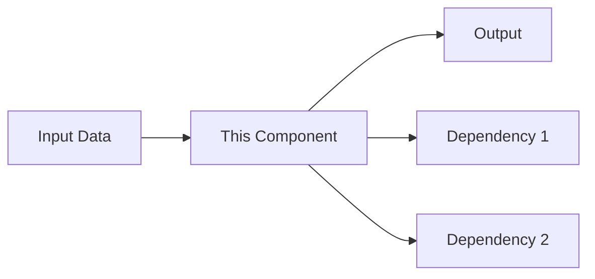

# Component: [Name]

**Last updated:** YYYY-MM-DD
**Lifecycle:** current  <!-- current | stale | deprecated | archived (see conventions/doc-lifecycle.md) -->
**Location:** `src/path/to/component`
**Owner:** Team/Person

## Purpose

<!-- What this component does and which problem it solves. One paragraph. Terms from docs/system/glossary.md. -->

## Architecture



## Owns

<!-- The data and the decisions this component is the source of truth for; other components reference them by id. -->

## Interfaces

<!-- What it exposes and what it consumes. Contract summary, not the full API: link the reference. -->

| Interface | Kind (HTTP / event / job / function) | Direction (in / out) | Contract | Idempotent |
|-----------|--------------------------------------|----------------------|----------|------------|
| | | | | |

### Entry point

```
// language of the project: the main entry point, its signature, one line on what it returns
```

### Configuration

| Config | Type | Default | Description |
|--------|------|---------|-------------|
| `maxRetries` | number | 3 | - |

## Data Flow

<!-- How data moves in and out, and where state lives. -->

## Dependencies and failure modes

| Dependency | Why | When it fails | Fallback | Replaceable by |
|------------|-----|---------------|----------|----------------|
| Redis | Caching | reads go to the database | none needed | any KV store |

## Known Limitations

- Limitation 1
- Limitation 2

## Related

- [Architecture overview](../architecture/README.md)
- [Flow diagram](../flows/relevant-flow.md)
- <!-- ADRs that shaped this component -->
