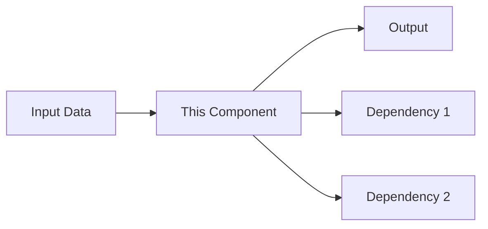

# Component: [Name]

**Last updated:** YYYY-MM-DD  
**Location:** `src/path/to/component`  
**Owner:** Team/Person  

## Purpose

<!-- What does this component do? What problem does it solve? -->

## Architecture



## Public API

### Key Functions/Methods

```typescript
// Main entry point
function processOrder(order: Order): Promise<OrderResult>
```

### Configuration

| Config | Type | Default | Description |
|--------|------|---------|-------------|
| `maxRetries` | number | 3 | — |

## Data Flow

<!-- How does data move in and out? -->

## Dependencies

| Dependency | Why | Can We Replace It? |
|-----------|-----|-------------------|
| Redis | Caching | Yes, any KV store |

## Known Limitations

- Limitation 1
- Limitation 2

## Related

- [Architecture overview](../architecture/README.md)
- [Flow diagram](../flows/relevant-flow.md)
