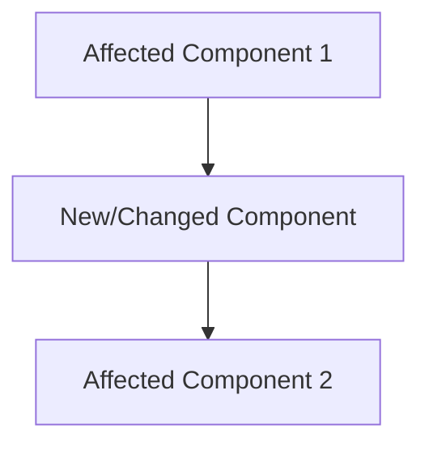
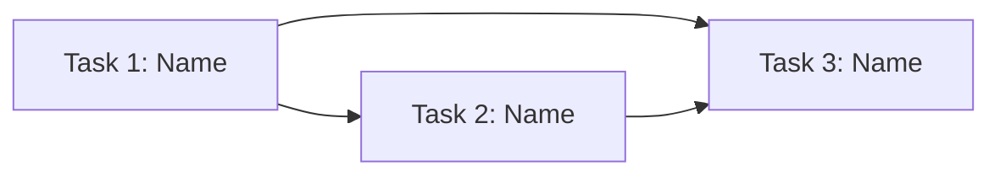

# Epic: [Feature Name]

**Status:** backlog | planning | in-progress | done | blocked  
**Priority:** P0 | P1 | P2 | P3  
**Created:** YYYY-MM-DD  
**Last updated:** YYYY-MM-DD  
**Target:** YYYY-MM-DD (optional)  

---

## Problem Statement

<!-- 2-3 sentences: What problem does this solve? Who has it? Why now? -->

## Goal

<!-- One sentence: What does success look like when this epic is complete? -->

## Success Criteria (Epic-Level)

<!-- High-level criteria. Each task will have its own detailed criteria. -->

- [ ] Criterion 1
- [ ] Criterion 2
- [ ] Criterion 3

---

## Solution Overview

<!-- Brief description of the overall approach. Keep it high-level. -->

### Architecture Impact

<!-- What parts of the system are affected? New components? Changed data flows? -->

### Scope

**In scope:**
- Item 1
- Item 2

**Out of scope:**
- Item 3 (future work)

---

## Task Breakdown

> Each task is a **separate file** in `docs/tasks/`, created via `/sk:new-task`.
> Each task is self-contained: independently buildable, testable, and shippable.
> Tasks are ordered by dependency (do top-to-bottom).

| # | Task | Complexity | Priority | Dependencies | File |
|---|------|-----------|----------|--------------|------|
| 1 | [Task Name] | M | P1 | None | [TASK-{N}-E{epicN}-p-{name}.md](./TASK-{N}-E{epicN}-p-{name}.md) |
| 2 | [Task Name] | M | P1 | Task 1 | [TASK-{N}-E{epicN}-p-{name}.md](./TASK-{N}-E{epicN}-p-{name}.md) |
| 3 | [Task Name] | S | P2 | Task 1, 2 | [TASK-{N}-E{epicN}-p-{name}.md](./TASK-{N}-E{epicN}-p-{name}.md) |

<!-- Task files are created with `/sk:new-task` using this epic as parent. -->
<!-- Each task file contains its own acceptance criteria, subtasks, and test plan. -->
<!-- The phase shortcut in the filename (p/d/t/x) updates as the task progresses. -->

---

## Dependency Graph

## Risks & Open Questions

| # | Risk / Question | Impact | Status | Resolution |
|---|----------------|--------|--------|-----------|
| 1 | — | High/Med/Low | Open/Resolved | — |

## Progress Log

<!-- Quick dated notes as work progresses. Helps context recovery. -->

| Date | Update |
|------|--------|
| YYYY-MM-DD | Epic created, planning started |
