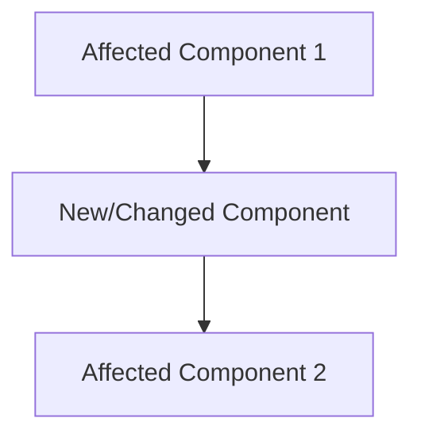
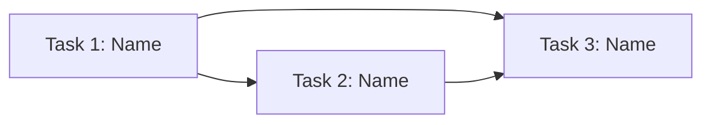

# Epic: [Feature Name]

---

## Problem Statement

<!-- One sentence: who, the unmet need, why it matters; no solution words. Then the evidence (data, quotes, tickets,
     or "hunch") and why now. From the PRD brief when there is one, narrowed to this epic. -->

## Goal

<!-- One sentence: what is true when this epic is done, and the success metric it moves (baseline → target). -->

## Success Criteria (Epic-Level)

<!-- Yes/no checks on the whole epic. When cut from a PRD, these are the acceptance lines of the FRs it delivers, by id. -->

- [ ] (FR-n) Criterion 1
- [ ] (FR-n) Criterion 2
- [ ] (NFR-n) Criterion 3

---

## Solution Overview

<!-- The approach in a few sentences. The thinnest end-to-end slice first; polish and hardening in later tasks. -->

### Architecture Impact

<!-- Only the parts of the system this epic touches: new or changed components, data model changes, new interfaces.
     Link the PRD architecture or docs/architecture/ instead of repeating them. -->

### Scope

**In scope:** <!-- the flows and FR ids this epic delivers -->
- Item 1
- Item 2

**Out of scope:** <!-- the PRD non-goals, and what is deferred to a later epic (name it) -->
- Item 3 (EPIC-{M})

---

## Task Breakdown

> Each task is a **separate file** in `docs/tasks/`, created via `/sk:new-task` (or by `/sk:prd` for the first epic).
> Each task is a vertical slice: independently buildable, testable, and shippable. At most 9 tasks; more means split the epic.
> Tasks are ordered by dependency (do top-to-bottom). Task files for a later epic are written when that epic starts.

| # | Task | Delivers | Complexity | Priority | Dependencies | File |
|---|------|----------|------------|----------|--------------|------|
| 1 | [Task Name] | FR-1, FR-2 | M | P1 | None | [TASK-{N}-E{epicN}-{name}.md](./TASK-{N}-E{epicN}-{name}.md) |
| 2 | [Task Name] | FR-3 | M | P1 | Task 1 | [TASK-{N}-E{epicN}-{name}.md](./TASK-{N}-E{epicN}-{name}.md) |
| 3 | [Task Name] | NFR-1 | S | P2 | Task 1, 2 | not yet created |

---

## Dependency Graph

## Risks & Open Questions

<!-- A risk names what it blocks. An open question has a recommended answer; none stays open past the task it blocks. -->

| # | Risk / Question | Impact | Blocks | Status | Resolution |
|---|-----------------|--------|--------|--------|------------|
| 1 | - | High/Med/Low | Task n / nothing yet | Open/Resolved | - |

## Progress Log

<!-- Quick dated notes as work progresses. Helps context recovery. -->

| Date | Update |
|------|--------|
| YYYY-MM-DD | Epic created, planning started |
