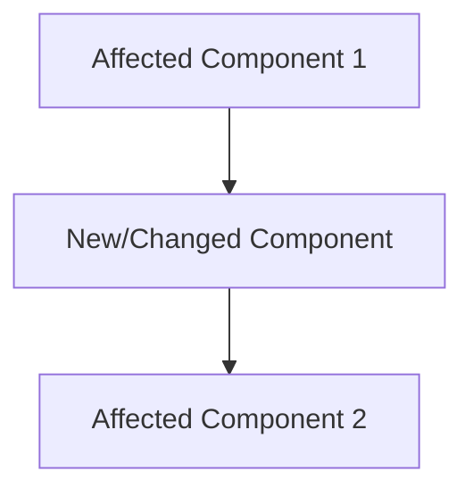
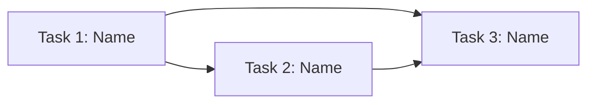

# Epic: [Feature Name]

**Status:** backlog | planning | in-progress | done | blocked  
**Priority:** P0 | P1 | P2 | P3  
**Created:** YYYY-MM-DD  
**Last updated:** YYYY-MM-DD  
**Target:** YYYY-MM-DD (optional)  

---

## Problem Statement

<!-- 2-3 sentences: What problem does this solve? Who has it? Why now? -->

## Goal

<!-- One sentence: What does success look like when this epic is complete? -->

## Success Criteria (Epic-Level)

<!-- High-level criteria. Each task will have its own detailed criteria. -->

- [ ] Criterion 1
- [ ] Criterion 2
- [ ] Criterion 3

---

## Solution Overview

<!-- Brief description of the overall approach. Keep it high-level. -->

### Architecture Impact

<!-- What parts of the system are affected? New components? Changed data flows? -->

### Scope

**In scope:**
- Item 1
- Item 2

**Out of scope:**
- Item 3 (future work)

---

## Task Breakdown

> Each task is self-contained: independently buildable, testable, and shippable.
> Tasks are ordered by dependency (do top-to-bottom).

### Task 1: [Task Name]

**Status:** `backlog` | **Complexity:** M | **Priority:** P1

<!-- One sentence: What does this task deliver? -->

**Acceptance Criteria:**
- [ ] AC 1
- [ ] AC 2

**Subtasks:**
- [ ] `[PLAN]` Define data model / schema changes
- [ ] `[DEV]` Implement [specific thing]
- [ ] `[DEV]` Implement [specific thing]
- [ ] `[TEST]` Write unit tests for [what]
- [ ] `[TEST]` Verify acceptance criteria
- [ ] `[DOCS]` Update [which docs]

**Dependencies:** None | Task N must complete first
**Files affected:** `src/path/to/file.ts`, `docs/system/schema.md`

---

### Task 2: [Task Name]

**Status:** `backlog` | **Complexity:** M | **Priority:** P1

<!-- One sentence: What does this task deliver? -->

**Acceptance Criteria:**
- [ ] AC 1
- [ ] AC 2

**Subtasks:**
- [ ] `[PLAN]` Review API contract / design endpoint
- [ ] `[DEV]` Implement [specific thing]
- [ ] `[DEV]` Implement [specific thing]
- [ ] `[TEST]` Write tests
- [ ] `[TEST]` Verify acceptance criteria
- [ ] `[DOCS]` Update [which docs]

**Dependencies:** Task 1 (needs schema)
**Files affected:** `src/path/to/file.ts`

---

### Task 3: [Task Name]

**Status:** `backlog` | **Complexity:** S | **Priority:** P2

**Acceptance Criteria:**
- [ ] AC 1

**Subtasks:**
- [ ] `[DEV]` Implement [specific thing]
- [ ] `[TEST]` Write tests
- [ ] `[DOCS]` Update [which docs]

**Dependencies:** Task 1, Task 2  
**Files affected:** `src/path/to/file.ts`

---

## Dependency Graph

## Risks & Open Questions

| # | Risk / Question | Impact | Status | Resolution |
|---|----------------|--------|--------|-----------|
| 1 | — | High/Med/Low | Open/Resolved | — |

## Progress Log

<!-- Quick dated notes as work progresses. Helps context recovery. -->

| Date | Update |
|------|--------|
| YYYY-MM-DD | Epic created, planning started |
