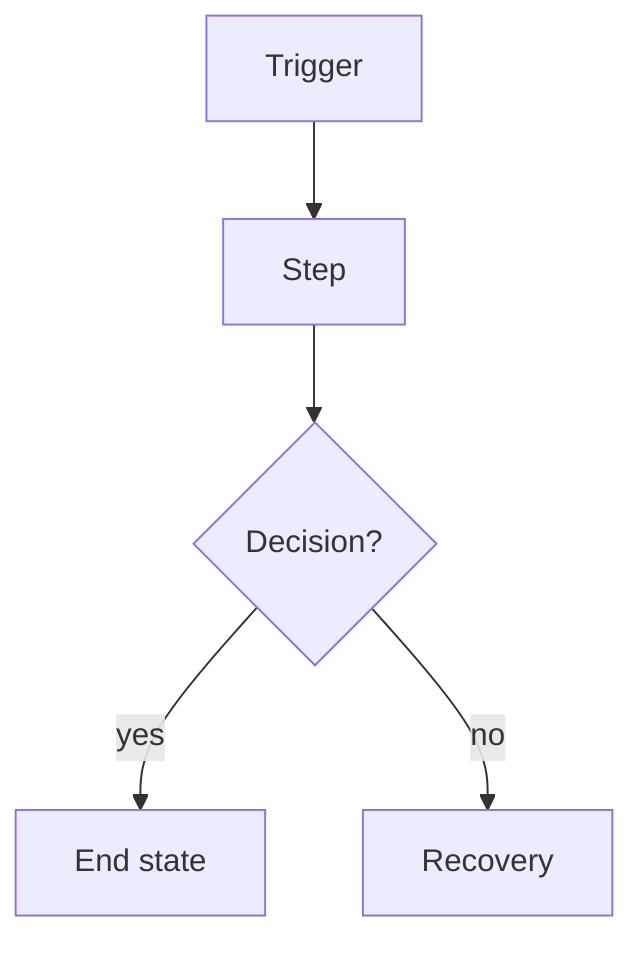
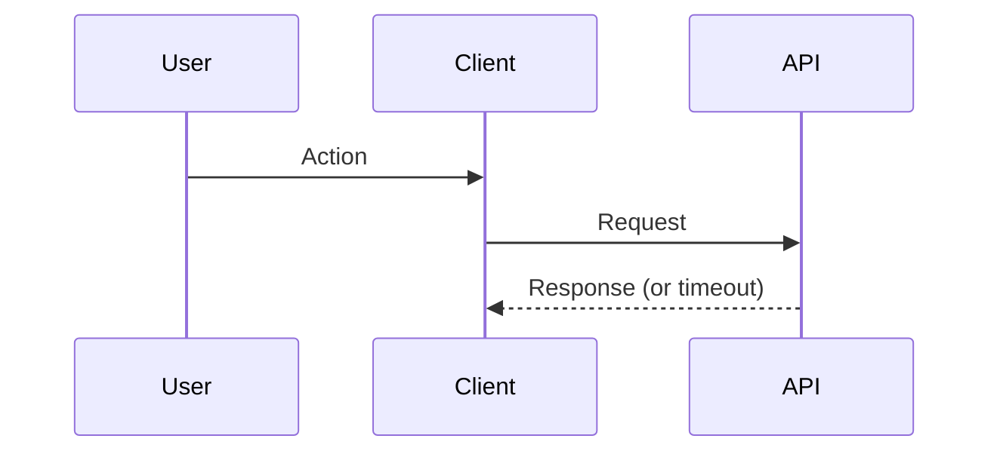
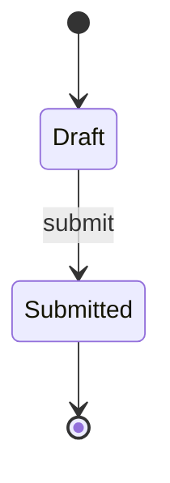

# Flow: [Process Name]

**Last updated:** YYYY-MM-DD
**Lifecycle:** current  <!-- current | stale | deprecated | archived (see conventions/doc-lifecycle.md) -->
**Source:** `src/path/to/flow-code`  <!-- code paths this flow describes (enables code-drift detection); or PRD-N F-n before it is built -->
**Type:** User flow | Sequence | Flowchart | State | Entity Relationship
**Format:** Mermaid | SVG

## Overview

<!-- 1-2 sentences: what this flow represents. For a user flow: persona, trigger, preconditions, end state. -->

**Persona:** · **Trigger:** · **Preconditions:** · **End state:**

## Diagram

<!-- SVG: create a separate .svg file with the technical-diagrams skill and link it: See [process-name.svg](./process-name.svg)
     Mermaid: keep the one block that fits, delete the others. Above ~15 nodes, add this first line inside the block:
     %%{init: {"flowchart": {"defaultRenderer": "elk"}} }%% -->

## Steps

<!-- For a user flow: what the user does and what the system does, numbered to match the diagram. -->

| # | User does | System does |
|---|-----------|-------------|
| 1 | | |

## Error Paths

<!-- Every edge and failure case with its decided behaviour, not "show an error": the message, the recovery path,
     what is preserved. For a user flow, this is the edge-case table from the flow-design skill. -->

| Case | At step | Behaviour | Requirement |
|------|---------|-----------|-------------|
| | | | |

## Related Docs

- [Architecture doc](../architecture/relevant-component.md)
- [SOP for this process](../sop/relevant-sop.md)
- <!-- PRD-N / feature doc / ADRs -->
