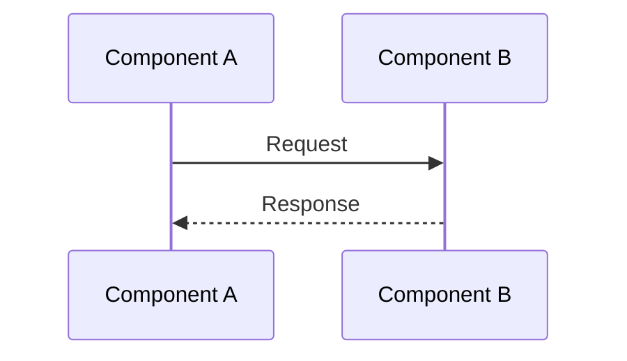
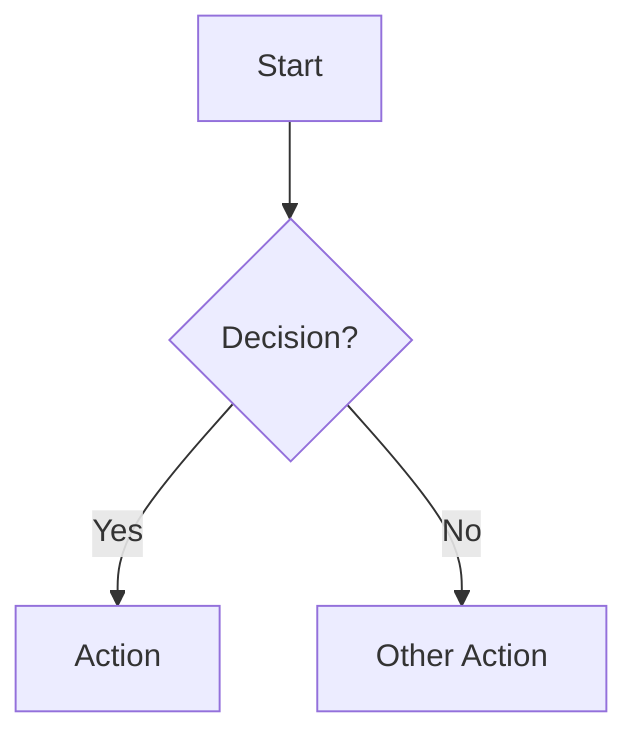
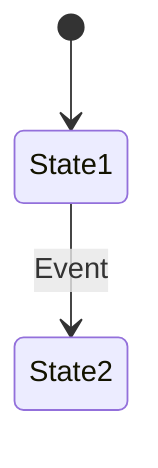

# Flow: [Process Name]

**Last updated:** YYYY-MM-DD
**Lifecycle:** current  <!-- current | stale | deprecated | archived (see conventions/doc-lifecycle.md) -->
**Source:** `src/path/to/flow-code`  <!-- code paths this flow describes — enables code-drift detection -->
**Type:** Sequence | Flowchart | State | Entity Relationship
**Format:** Mermaid | SVG

## Overview

<!-- 1-2 sentences explaining what this flow represents -->

## Diagram

<!-- For SVG diagrams: create a separate .svg file using the technical-diagrams skill,
     then link to it here:
     See [process-name.svg](./process-name.svg)
-->

<!-- For Mermaid diagrams: pick ONE diagram type below, delete the others -->

### Option A: Sequence Diagram (for component interactions)

### Option B: Flowchart (for processes with decisions)

### Option C: State Diagram (for entity lifecycles)

## Step-by-Step Explanation

1. **Step name** — What happens and why
2. **Step name** — What happens and why

## Error Paths

<!-- What happens when things go wrong? -->

## Related Docs

- [Architecture doc](../architecture/relevant-component.md)
- [SOP for this process](../sop/relevant-sop.md)
