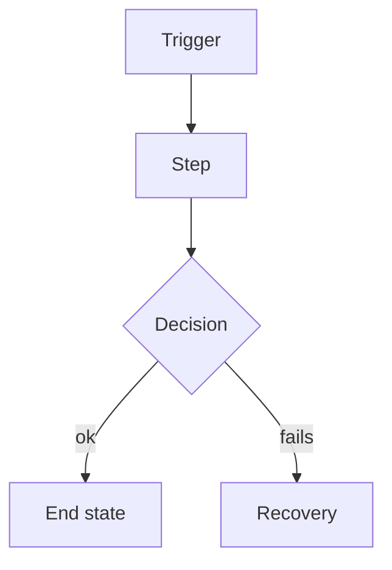
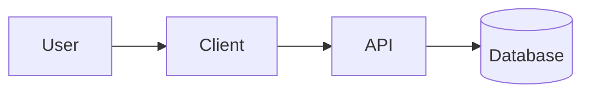
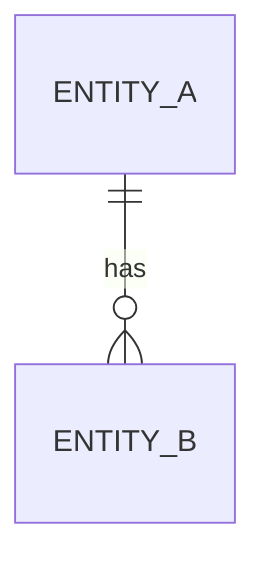

# PRD: {Product or feature name}

<!-- Written by /sk:prd one section at a time; a section is filled only after the user has confirmed it.
     This file is the session state: /sk:prd PRD-{N} resumes at the first stage not marked settled. -->

| Stage | Status | Settled on |
|-------|--------|------------|
| 1. Brief | open | |
| 2. User flows | open | |
| 3. Requirements | open | |
| 4. Architecture | open | |
| 5. Delivery (epics) | open | |
| 6. Review | open | |

---

## 1. Brief

**Problem:** <!-- One sentence: who, what unmet need, why it matters. No solution words. -->

**Who has it:** <!-- The primary persona; see Users below -->

**Evidence:** <!-- Data, quotes, tickets, lost deals, or "hunch" (say which) -->

**Why now:** <!-- What changed that makes this worth doing now -->

### Success metrics

<!-- Outcomes, not features. These are not acceptance criteria. -->

| Metric | Baseline | Target | How measured | By when |
|--------|----------|--------|--------------|---------|
| | | | | |

### Non-goals

<!-- What this deliberately does not do. At least one. -->

-

**Appetite:** <!-- Time we will spend before we stop and reassess -->

### Riskiest assumptions

| # | Assumption | Evidence today | Cheapest test |
|---|------------|----------------|---------------|
| A1 | | | |

### Users

| Persona | Role and context | What they are trying to get done | How often |
|---------|------------------|----------------------------------|-----------|
| | | | |

### Glossary

<!-- Terms settled in this PRD, also written to docs/system/glossary.md (the project-wide list). -->

| Term | Definition | Avoid |
|------|------------|-------|
| | | |

---

## 2. User flows

<!-- One subsection per flow. Primary flows first. Include the flows that are usually forgotten:
     first use / onboarding, invite and roles, settings, notifications, billing, export and delete, admin/support. -->

### F-1: {Flow name}

<!-- Feature PRD: for an existing flow, link its file in docs/flows/ and describe only what changes. -->

**Persona:** · **Trigger:** · **Preconditions:** · **End state:**

| # | User does | System does | FR |
|---|-----------|-------------|----|
| 1 | | | FR-1 |

**Edge and failure cases** (each one decided, none left as "handle errors"):

| Case | At step | Decided behaviour | FR |
|------|---------|-------------------|----|
| | | | |

**Prototype:** <!-- link to the prototype file and the variant chosen, with why; or "not prototyped: <reason>" -->

---

## 3. Requirements

### Functional

<!-- Every row traces to a flow step or the Brief. Must = the PRD fails without it. -->

| ID | Requirement | Priority | Traces to | Acceptance (Given / When / Then) |
|----|-------------|----------|-----------|----------------------------------|
| FR-1 | | Must | F-1 #1 | Given … When … Then … |

### Non-functional

<!-- Every row has a number or a named standard. "Fast" and "secure" are not requirements. -->

| ID | Category | Requirement | Target | Verified by |
|----|----------|-------------|--------|-------------|
| NFR-1 | Performance | | | |

---

## 4. Architecture

### Overview

### Components

| Component | Responsibility | Owns data | New / changed / existing |
|-----------|----------------|-----------|--------------------------|
| | | | |

### Data model

<!-- Ownership and tenancy, ID format, soft vs hard delete, retention, PII fields. -->

### Interfaces

| Interface | Kind (HTTP / event / job / webhook) | Caller → callee | Contract summary | Idempotent |
|-----------|--------------------------------------|-----------------|------------------|------------|
| | | | | |

### Integrations

| Service | Used for | When it fails | Fallback |
|---------|----------|---------------|----------|
| | | | |

### Access control

| Role | Action | Allowed | Scope |
|------|--------|---------|-------|
| | | | |

### Consistency, concurrency and background work

<!-- Transactions, idempotency keys, double-submit, concurrent edits, queues and retries, ordering. -->

### Security and privacy

| Threat | Where | Mitigation |
|--------|-------|------------|
| | | |

### Observability, deployment and migration

<!-- What is logged and alerted, environments, feature flags, rollout order, migration from today's system. -->

### Traceability

<!-- Every flow step lands on a component and an interface. A step with no row is a gap. -->

| Flow step | Component | Interface |
|-----------|-----------|-----------|
| F-1 #1 | | |

### Decisions

| ADR | Decision |
|-----|----------|
| | |

---

## 5. Delivery

<!-- Vertical slices. Epic 1 is the thinnest end-to-end path through the primary flow. -->

| Epic | Delivers (flows / FRs) | Depends on | Appetite | File |
|------|------------------------|------------|----------|------|
| | | | | |

**Coverage:** <!-- every Must FR appears in exactly one epic: yes / list the gaps -->

---

## 6. Risks and open questions

| # | Risk or question | Impact | Blocks | Status | Resolution |
|---|------------------|--------|--------|--------|------------|
| | | High/Med/Low | stage or FR | Open | |

## Decision log

| Date | Decision | Stage |
|------|----------|-------|
| YYYY-MM-DD | PRD created | brief |

## Appendix

<!-- Research, links, anything that would clutter the sections above. -->
