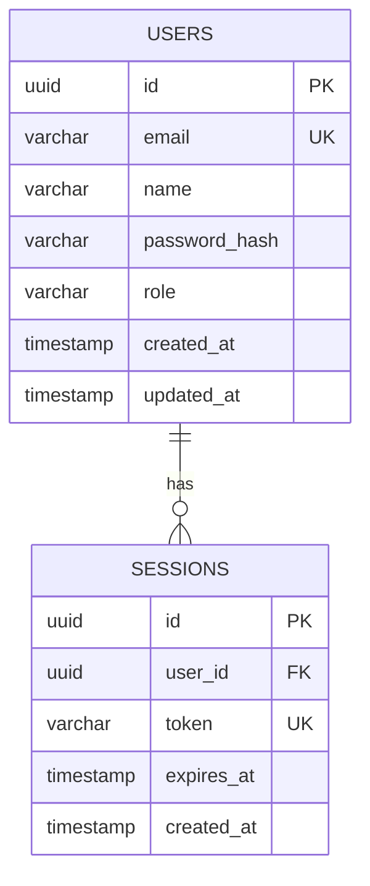

# Database Schema

**Last updated:** YYYY-MM-DD

## Entity Relationship Diagram

## Tables

### users

Primary user accounts table.

| Column | Type | Constraints | Description |
|--------|------|-------------|-------------|
| `id` | uuid | PK, default gen | Unique identifier |
| `email` | varchar(255) | UNIQUE, NOT NULL | Login email |
| `name` | varchar(255) | NOT NULL | Display name |
| `password_hash` | varchar(255) | NOT NULL | bcrypt hash |
| `role` | varchar(50) | NOT NULL, default 'user' | user, admin |
| `created_at` | timestamptz | NOT NULL, default now() | - |
| `updated_at` | timestamptz | NOT NULL, default now() | - |

**Indexes:** `idx_users_email` on `email`

---

<!-- Add more tables following the same pattern -->

## Migration History

| Migration | Date | Description |
|-----------|------|-------------|
| `001_initial_schema` | YYYY-MM-DD | Users, sessions tables |
